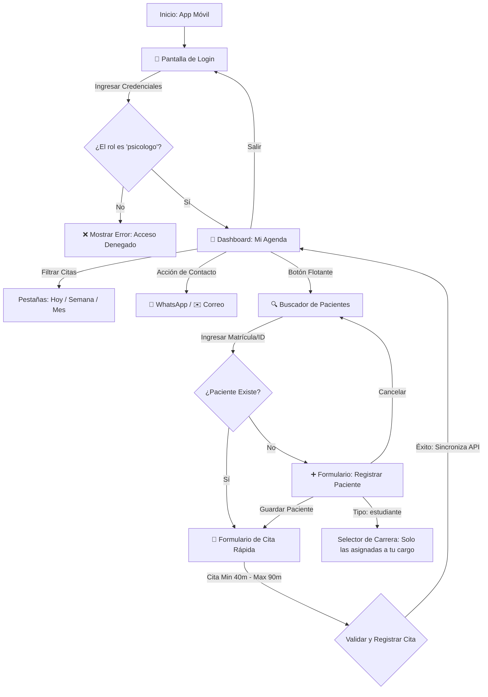

# AppEHR - Asistente Móvil de Psicología 🏥🧠

**AppEHR** es una aplicación móvil y de escritorio multiplataforma desarrollada en **.NET MAUI (con .NET 10)**. Funciona como un asistente operativo de alta velocidad pensado exclusivamente para los **psicólogos** de la institución educativa. Les permite consultar su itinerario diario, dar de alta nuevos alumnos sobre la marcha y agendar citas rápidas directamente al encontrarse con pacientes en pasillos, cafeterías u otros espacios comunes del campus.

---

## 🗺️ Diagrama de Flujo y Pantallas

El siguiente diagrama detalla la navegación y la lógica de validación implementada en el flujo de pantallas de la aplicación:



---

## 🎨 Características Destacadas

*   **Diseño Crystal Glass (Glassmorphism):** Estética moderna con fondos degradados y tarjetas semi-transparentes con bordes luminosos de baja opacidad, consistente con el portal principal `ut-care`.
*   **Seguridad de Rol Estricta:** Bloqueo explícito a nivel de autenticación móvil para denegar el acceso a roles administrativos o médicos (`admin`, `enfermero`, etc.).
*   **KPIs de Desempeño Compactos:** Visualización de horas acumuladas de consulta a la semana mediante barra de progreso, y contadores mensuales de efectividad (citas totales, citas completadas, citas canceladas).
*   **Filtro de Carreras Asignadas:** Al dar de alta un alumno nuevo, el selector de carreras del psicólogo se filtra de manera inteligente en base a sus asignaciones (obtenidas desde `/api/users/me/careers`), impidiendo registrar alumnos fuera de sus áreas.
*   **Contacto Directo Integrado:** Accesos directos en las tarjetas de citas para iniciar chats directos de WhatsApp o abrir clientes de correo nativos de forma automática.

---

## 📋 Requisitos del Sistema

Antes de iniciar la app, asegúrate de cumplir con las siguientes herramientas en tu entorno de desarrollo:

*   **SDK de .NET:** Versión **10.0** o superior (`dotnet --version`).
*   **Workload de MAUI:** Instalado y configurado (`dotnet workload install maui`).
*   **Node.js & npm:** Versión **18.0** o superior instalada para correr el backend local.
*   **Base de Datos:** Docker Desktop ejecutándose (para levantar PostgreSQL) o una base de datos local equivalente.
*   **Emulador de Dispositivos:** Android Studio configurado con un dispositivo virtual (AVD) o Windows 10/11 con Developer Mode habilitado.

---

## 🚀 Pasos para Iniciar la App (Desde Cero / Clonada)

Sigue esta secuencia para levantar el entorno de base de datos, backend y la aplicación móvil de manera local:

### Paso 1: Configurar e Iniciar la Base de Datos y el Backend
1. Abre tu terminal y navega al directorio del backend:
   ```bash
   cd api
   ```
2. Crea el archivo de variables de entorno `.env` copiando el ejemplo base:
   ```bash
   cp .env.example .env
   ```
3. Ejecuta el script de inicialización automática. Este comando instalará los paquetes de Node, levantará la base de datos PostgreSQL en Docker, creará el esquema de base de datos a través de Prisma e inyectará los seeds iniciales:
   ```bash
   npm run setup
   ```
4. Inicia el servidor del backend en modo desarrollo:
   ```bash
   npm run dev
   ```
   *El backend estará disponible en `http://localhost:5000/api`.*

---

### Paso 2: Iniciar la Aplicación Móvil (AppEHR)
Abre otra terminal independiente para compilar y ejecutar el proyecto móvil:

1. Ve a la carpeta de la aplicación móvil:
   ```bash
   cd AppEHR
   ```
2. Restaura los paquetes NuGet necesarios:
   ```bash
   dotnet restore
   ```
3. Compila e inicia la aplicación según tu plataforma objetivo:
   *   **Para ejecutar en Windows Desktop:**
       ```bash
       dotnet build -t:Run -f net10.0-windows10.0.19041.0
       ```
   *   **Para ejecutar en Emulador de Android (con el emulador ya encendido):**
       ```bash
       dotnet build -t:Run -f net10.0-android
       ```
       *(La app detecta automáticamente que se ejecuta en Android y redirige de forma transparente la dirección localhost al gateway del host `10.0.2.2:5000`).*

---

## 🧪 Pruebas UAT (User Acceptance Testing)

Para realizar las pruebas de aceptación y validar las reglas de negocio descritas, utiliza los siguientes usuarios precargados en el ambiente de desarrollo (`dev`):

### 🔑 Credenciales de Acceso

| Rol de Usuario | Nombre Completo | Correo de Acceso | Contraseña común | Comportamiento Esperado UAT |
| :--- | :--- | :--- | :--- | :--- |
| **Psicólogo Operativo** | Carlos Alexis Rodriguez Garcia | `carlos.rodriguez@ehr-system.com` | `Password123!` | **Acceso Exitoso.** Puede ver su agenda, registrar pacientes bajo sus carreras académicas asociadas y agendar citas. |
| **Coordinador Psicología** | Orlando de Jesus Casas Davila | `orlando.casas@ehr-system.com` | `Password123!` | **Acceso Bloqueado.** Muestra alerta: *"Acceso exclusivo para personal de psicología"*. |
| **Administrador** | Xochilt Clara Villar Diego | `admin@ehr-system.com` | `Password123!` | **Acceso Bloqueado.** Muestra alerta de acceso exclusivo. |
| **Enfermero Operativo** | Daniela Mayte Guevara Castillo | `daniela.guevara@ehr-system.com` | `Password123!` | **Acceso Bloqueado.** Muestra alerta de acceso exclusivo. |

### 🛠️ Casos de Prueba Recomendados para UAT

1.  **Validación de Acceso:** Intenta ingresar con el usuario `daniela.guevara@ehr-system.com`. Verifica que el sistema te impida el acceso. Posteriormente, inicia sesión con `carlos.rodriguez@ehr-system.com` y confirma que entras al dashboard principal.
2.  **Validación de Cita Rápida (Duración):** Busca la matrícula de un alumno existente (ej. `1001`) e intenta reservar una cita con una duración de 30 minutos. Comprueba que el formulario arroje un mensaje de error y te impida guardarla. Sube la duración a 50 minutos y confirma que se guarde exitosamente.
3.  **Filtro de Carreras en Nuevos Registros:** Presiona en registrar un nuevo paciente de tipo `student`. Despliega el selector de Carrera Académica y comprueba que solo se muestren las carreras asociadas al psicólogo (ej: *TSU en Desarrollo y Gestión de Software* e *Ingeniería en Desarrollo y Gestión de Software*).
4.  **Prueba de Enlace WhatsApp/Correo:** En tu itinerario del Dashboard, presiona en el botón `💬 WhatsApp` de cualquier cita y verifica que redirija a tu navegador abriendo la URL `https://wa.me/` con el número telefónico del paciente.

---

## 🤖 Pruebas Automatizadas (Unit Tests)

Si deseas verificar el comportamiento lógico de los ViewModels localmente sin levantar servidores o emuladores físicos, ejecuta el conjunto de tests unitarios:
```bash
cd AppEHR.Tests
dotnet test
```
*Los tests validan de forma aislada las restricciones de duración, la restricción de inicio de sesión por rol y el agendado de citas futuras.*
