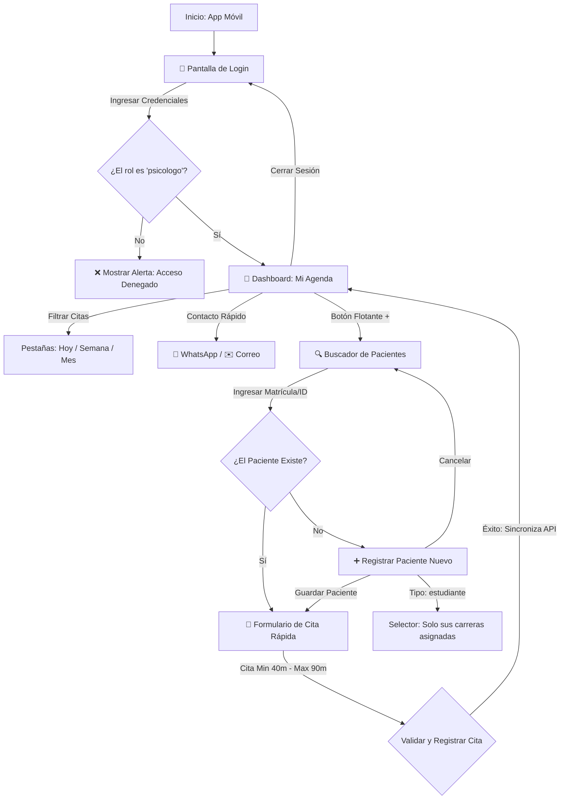

# 📱 AppEHR - Asistente Móvil de Psicología 🏥🧠

> **Navegación Rápida:**
> *   **[🏥 Regresar al README Principal](../README.md)**
> *   **[⚙️ Backend (API REST)](../api/README.md)**
> *   **[💻 Cliente Web (ut-care)](../ut-care/README.md)**

---

## 📋 Descripción

**AppEHR** es una aplicación multiplataforma construida sobre el framework **.NET MAUI (.NET 10) con C# y XAML**. Funciona como un asistente de alta velocidad diseñado de forma exclusiva para los **psicólogos** operativos. 

Su funcionalidad se centra en:
1.  Consultar el itinerario diario de citas asignadas.
2.  Visualizar métricas semanales y mensuales de rendimiento.
3.  Registrar pacientes de tipo estudiante (restringido a las carreras asignadas del psicólogo) y de tipo docente/administrativo.
4.  Agendar citas rápidas presenciales sobre la marcha cuando los alumnos los abordan en pasillos o áreas comunes del campus.

---

## 🗺️ Diagrama de Flujo de Pantallas

El siguiente diagrama detalla la lógica de pantallas y las validaciones de negocio en tiempo de ejecución:



---

## 📋 Requisitos del Entorno

Para compilar y ejecutar el proyecto móvil localmente, necesitas contar con:

*   **SDK de .NET 10.0** o superior.
*   **Workload de MAUI** instalado (`dotnet workload install maui`).
*   **Android Studio** (Para herramientas de SDK y emuladores Android).
*   **Windows 10/11** con el Modo Desarrollador activado (si compilas para Windows Desktop).

---

## 🚀 Pasos para Compilar y Ejecutar

Asegúrate de que la API backend esté ejecutándose en tu PC en el puerto `5000`.

1.  **Navegar al directorio móvil:**
    ```bash
    cd AppEHR
    ```
2.  **Restaurar dependencias NuGet:**
    ```bash
    dotnet restore
    ```
3.  **Ejecutar según la plataforma:**
    *   **En Windows (Desktop):**
        ```bash
        dotnet build -t:Run -f net10.0-windows10.0.19041.0
        ```
    *   **En Emulador Android (con emulador encendido):**
        ```bash
        dotnet build -t:Run -f net10.0-android
        ```
        *(En emulador la app detecta automáticamente la red local y usa `http://10.0.2.2:5000/api` para el backend).*

---

## 📱 Depuración en Dispositivo Android Físico

Al depurar en un celular físico real por cable USB, realiza las siguientes configuraciones de seguridad y ruteo de red:

### 1. Activar permisos de desarrollador en el celular
*   Ve a **Ajustes > Opciones de desarrollador**.
*   Activa **Depuración USB** e **Instalar vía USB (Install via USB)**.
    *   *Dispositivos Xiaomi (MIUI/HyperOS):* Activar "Instalar vía USB" requiere conexión de datos móviles activa en el teléfono e iniciar sesión en tu cuenta Mi Account.
*   Mantén la pantalla del celular desbloqueada. Durante el despliegue de Visual Studio, aparecerá una alerta de seguridad preguntando si aceptas la instalación. Presiona **Aceptar** en menos de 10 segundos para evitar el error `INSTALL_FAILED_USER_RESTRICTED`.

### 2. Establecer redirección de puertos USB (ADB Reverse)
Dado que un celular físico no puede resolver el alias `10.0.2.2`, el constructor de `ApiService.cs` conmuta automáticamente a `localhost` en dispositivos físicos. Para crear el túnel de comunicación a través del cable USB:
*   Con el celular conectado por USB, abre PowerShell en tu PC y ejecuta:
    ```powershell
    & "C:\Program Files (x86)\Android\android-sdk\platform-tools\adb.exe" reverse tcp:5000 tcp:5000
    ```
    *(Si tienes `adb` configurado en tu PATH, puedes escribir simplemente: `adb reverse tcp:5000 tcp:5000`)*
*   El comando confirmará imprimiendo `5000`. Listo, ahora las solicitudes HTTP de la app se redirigirán a la API de tu computadora.

---

## 🧪 Casos de Prueba UAT (User Acceptance Testing)

Utiliza la cuenta del psicólogo de desarrollo para validar las reglas de negocio en la app:
*   **Usuario:** `carlos.rodriguez@ehr-system.com`
*   **Contraseña:** `Password123!`

### Casos prácticos a validar:
1.  **Restricción de Rol:** Intenta iniciar sesión con `daniela.guevara@ehr-system.com` (enfermero) u `orlando.casas@ehr-system.com` (coordinador). Confirma que se muestre la alerta: *"Acceso exclusivo para personal de psicología"*.
2.  **Validación de Citas:** Intenta agendar una cita con una duración menor a 40 minutos (ej. 30 min). Comprueba que el sistema lo rechace. Ajusta a 50 minutos y confirma que se agende con éxito.
3.  **Restricción de Carreras:** Presiona registrar paciente nuevo, selecciona tipo `student`. Comprueba que en la lista de carreras únicamente figuren las asignadas a Carlos Rodriguez (*TSU en Desarrollo y Gestión de Software* e *Ingeniería en Desarrollo y Gestión de Software*).

---

## 🤖 Pruebas Automatizadas (Unit Tests)

La solución incluye un proyecto de pruebas en xUnit para verificar la lógica de los ViewModels y convertidores de forma aislada:
```bash
cd AppEHR.Tests
dotnet test
```
*Los tests mockean las llamadas HTTP a la API y validan de manera local las duraciones de las citas y validación de rol.*
