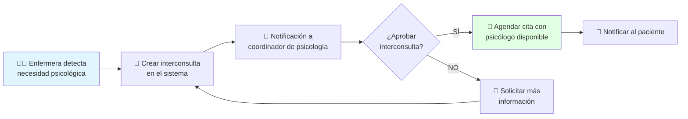
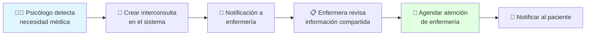

# 📊 DIAGRAMA DE FLUJO - PROCESO DE ATENCIÓN AL PACIENTE
## Sistema de Expediente Clínico Electrónico (EHR)

---

**Versión:** 1.0  
**Fecha:** 10 de Febrero, 2026  
**Departamentos:** Enfermería y Psicología

---

## 🎯 PROPÓSITO

Este diagrama representa el flujo completo del proceso de atención al paciente en el sistema EHR, desde el registro inicial hasta el seguimiento, incluyendo los puntos de decisión y las diferentes rutas que puede tomar un paciente.

---

## 📋 DIAGRAMA DE FLUJO PRINCIPAL

```mermaid
flowchart TD
    Start([🏥 PACIENTE LLEGA AL SERVICIO]) --> CheckNew{¿Es paciente<br/>nuevo?}
    
    CheckNew -->|SÍ| CreateRecord[📝 CREAR EXPEDIENTE<br/>- Datos demográficos<br/>- Información de contacto<br/>- Tutor si es menor<br/>- Alergias y condiciones]
    CheckNew -->|NO| VerifyID[🔍 VERIFICAR IDENTIDAD<br/>- Matrícula<br/>- Nombre completo]
    
    CreateRecord --> ValidateData{✅ ¿Datos<br/>completos?}
    ValidateData -->|NO| RequestData[⚠️ SOLICITAR DATOS FALTANTES]
    RequestData --> CreateRecord
    ValidateData -->|SÍ| CheckAppt
    
    VerifyID --> UpdateInfo{¿Actualizar<br/>información?}
    UpdateInfo -->|SÍ| UpdateRecord[🔄 ACTUALIZAR DATOS]
    UpdateInfo -->|NO| CheckAppt
    UpdateRecord --> CheckAppt
    
    CheckAppt{¿Tiene cita<br/>programada?}
    CheckAppt -->|SÍ| ConfirmAppt[✅ CONFIRMAR ASISTENCIA<br/>- Marcar como presente<br/>- Notificar al profesional]
    CheckAppt -->|NO| CheckAvail{¿Hay<br/>disponibilidad?}
    
    CheckAvail -->|SÍ| CreateUrgent[🚨 CREAR CITA URGENTE<br/>- Asignar profesional disponible]
    CheckAvail -->|NO| AddWaitlist[📋 AGREGAR A LISTA DE ESPERA<br/>- Programar cita futura<br/>- Enviar notificación]
    
    CreateUrgent --> CheckService
    ConfirmAppt --> CheckService
    
    CheckService{¿Qué servicio<br/>requiere?}
    CheckService -->|ENFERMERÍA| Triage[🩺 TRIAJE - ENFERMERÍA<br/>- Motivo de consulta<br/>- Signos vitales<br/>- Identificar urgencias]
    CheckService -->|PSICOLOGÍA| PsyReview[📖 REVISAR HISTORIAL PSICOLÓGICO<br/>- Diagnósticos anteriores<br/>- Tratamiento actual<br/>- Evaluaciones previas]
    
    Triage --> CheckTriageUrgent{¿Requiere<br/>atención<br/>urgente?}
    CheckTriageUrgent -->|SÍ| EmergencyProcedure[🚑 ATENCIÓN DE EMERGENCIA<br/>- Procedimiento urgente<br/>- Derivar si necesario]
    CheckTriageUrgent -->|NO| NursingConsult[👩‍⚕️ CONSULTA DE ENFERMERÍA<br/>10-15 minutos]
    
    NursingConsult --> CheckProcedure{¿Requiere<br/>procedimiento?}
    CheckProcedure -->|SÍ| PerformProcedure[💉 REALIZAR PROCEDIMIENTO<br/>- Curación<br/>- Inyección<br/>- Vendaje<br/>- Etc.]
    CheckProcedure -->|NO| CheckMeds
    
    PerformProcedure --> RecordProcedure[📝 REGISTRAR PROCEDIMIENTO<br/>- Tipo<br/>- Materiales<br/>- Observaciones<br/>- Firma electrónica]
    RecordProcedure --> CheckMeds
    
    CheckMeds{¿Requiere<br/>medicamento?}
    CheckMeds -->|SÍ| Verify5Rights[✅ VERIFICAR 5 CORRECTOS<br/>1. Paciente correcto<br/>2. Medicamento correcto<br/>3. Dosis correcta<br/>4. Vía correcta<br/>5. Hora correcta]
    
    Verify5Rights --> CheckAllergies{¿Alergias o<br/>contraindicaciones?}
    CheckAllergies -->|SÍ| AlertAllergy[🚨 ALERTA DE ALERGIA<br/>- Notificar al profesional<br/>- Buscar alternativa]
    CheckAllergies -->|NO| AdministerMed[💊 ADMINISTRAR MEDICAMENTO<br/>- Registrar en sistema<br/>- Observar reacción]
    
    AlertAllergy --> ConsultDoctor[👨‍⚕️ CONSULTAR CON MÉDICO]
    ConsultDoctor --> End1
    
    AdministerMed --> RecordAdmin[📋 REGISTRAR ADMINISTRACIÓN<br/>- Fecha/hora<br/>- Dosis<br/>- Lote<br/>- Firma electrónica]
    
    CheckMeds -->|NO| CheckReferPsy
    RecordAdmin --> CheckReferPsy
    EmergencyProcedure --> CheckReferPsy
    
    CheckReferPsy{¿Derivar a<br/>psicología?}
    CheckReferPsy -->|SÍ| CreateInterconsult[🔄 CREAR INTERCONSULTA<br/>- Compartir información relevante<br/>- Programar cita con psicólogo]
    CheckReferPsy -->|NO| NursingClose
    
    CreateInterconsult --> NursingClose[📄 CERRAR CONSULTA ENFERMERÍA<br/>- Guardar notas<br/>- Generar indicaciones<br/>- Programar seguimiento]
    
    NursingClose --> End1([✅ FIN - PROCESO ENFERMERÍA])
    
    PsyReview --> CheckType{¿Tipo de<br/>consulta?}
    CheckType -->|PRIMERA VEZ| InitialEval[🆕 EVALUACIÓN INICIAL<br/>60-90 minutos<br/>- Historia clínica completa<br/>- Motivo de consulta<br/>- Antecedentes]
    CheckType -->|SEGUIMIENTO| FollowUp[🔄 CONSULTA DE SEGUIMIENTO<br/>50 minutos<br/>- Revisar avances<br/>- Evaluar tratamiento]
    CheckType -->|GRUPAL| GroupSession[👥 SESIÓN GRUPAL<br/>90 minutos<br/>- Terapia de grupo]
    
    InitialEval --> ClinicalInterview[🗣️ ENTREVISTA CLÍNICA<br/>- Síntomas actuales<br/>- Contexto personal<br/>- Redes de apoyo]
    FollowUp --> ReviewProgress[📈 REVISAR PROGRESO<br/>- Tareas completadas<br/>- Cambios observados<br/>- Dificultades]
    GroupSession --> FacilitateGroup[👨‍🏫 FACILITAR SESIÓN<br/>- Dinámicas grupales<br/>- Apoyo entre pares]
    
    ClinicalInterview --> CheckAssessment{¿Requiere<br/>evaluación<br/>psicométrica?}
    CheckAssessment -->|SÍ| ApplyTest[📊 APLICAR EVALUACIONES<br/>- Wizz/Wazz<br/>- Escalas de Beck<br/>- Otras pruebas]
    CheckAssessment -->|NO| AnalyzeCase
    
    ApplyTest --> ScoreTest[📈 CALIFICAR E INTERPRETAR<br/>- Registrar resultados<br/>- Análisis clínico]
    ScoreTest --> AnalyzeCase
    
    ReviewProgress --> AnalyzeCase[🔍 ANÁLISIS DE CASO<br/>- Síntesis de información<br/>- Identificar patrones<br/>- Evaluar evolución]
    FacilitateGroup --> RecordGroupSession[📝 REGISTRAR SESIÓN GRUPAL<br/>- Asistentes<br/>- Temas tratados<br/>- Observaciones]
    
    AnalyzeCase --> CheckDiagnosis{¿Asignar o<br/>actualizar<br/>diagnóstico?}
    CheckDiagnosis -->|SÍ| AssignDiagnosis[🏷️ ASIGNAR DIAGNÓSTICO<br/>DSM-5 o CIE-10/11<br/>- Código<br/>- Severidad<br/>- Especificadores]
    CheckDiagnosis -->|NO| TreatmentPlan
    
    AssignDiagnosis --> CheckComplex{¿Diagnóstico<br/>complejo?}
    CheckComplex -->|SÍ| SupervisorReview[👨‍💼 REVISIÓN DE COORDINADOR<br/>- Validar diagnóstico<br/>- Aprobar tratamiento]
    CheckComplex -->|NO| TreatmentPlan
    
    SupervisorReview --> TreatmentPlan[📋 PLAN DE TRATAMIENTO<br/>- Objetivos terapéuticos<br/>- Estrategias<br/>- Técnicas a utilizar<br/>- Frecuencia de sesiones]
    RecordGroupSession --> TreatmentPlan
    
    TreatmentPlan --> AssignTasks[✏️ ASIGNAR TAREAS<br/>- Actividades para casa<br/>- Ejercicios terapéuticos<br/>- Auto-monitoreo]
    
    AssignTasks --> RecordSession[📝 REGISTRAR NOTA CLÍNICA<br/>- Notas de evolución<br/>- Avances<br/>- Observaciones<br/>- Firma electrónica]
    
    RecordSession --> CheckFollowUp{¿Requiere<br/>seguimiento?}
    CheckFollowUp -->|SÍ| ScheduleNext[📅 PROGRAMAR SIGUIENTE CITA<br/>- Según plan de tratamiento<br/>- Enviar recordatorio]
    CheckFollowUp -->|NO| CheckDischarge{¿Alta<br/>terapéutica?}
    
    CheckDischarge -->|SÍ| DischargeProcess[👋 PROCESO DE ALTA<br/>- Resumen de tratamiento<br/>- Recomendaciones finales<br/>- Cierre de expediente]
    CheckDischarge -->|NO| ScheduleNext
    
    ScheduleNext --> CheckInterconsult{¿Requiere<br/>interconsulta?}
    CheckInterconsult -->|SÍ| CreatePsyInterconsult[🔄 SOLICITAR INTERCONSULTA<br/>- Enfermería<br/>- Trabajo Social<br/>- Otro servicio]
    CheckInterconsult -->|NO| GenerateSummary
    
    CreatePsyInterconsult --> GenerateSummary[📄 GENERAR RESUMEN PARA PACIENTE<br/>- Información autorizada<br/>- Recomendaciones<br/>- Próximos pasos]
    
    DischargeProcess --> GenerateSummary
    
    GenerateSummary --> SendReminder[🔔 ENVIAR RECORDATORIOS<br/>- Próxima cita<br/>- Tareas pendientes<br/>- Seguimiento]
    
    SendReminder --> UpdateStats[📊 ACTUALIZAR ESTADÍSTICAS<br/>- Tipo de consulta<br/>- Diagnósticos<br/>- Indicadores]
    
    UpdateStats --> End2([✅ FIN - PROCESO PSICOLOGÍA])
    
    AddWaitlist --> End3([⏸️ PACIENTE EN LISTA DE ESPERA])
    
    style Start fill:#e1f5e1
    style End1 fill:#ffe1e1
    style End2 fill:#ffe1e1
    style End3 fill:#fff4e1
    style CheckNew fill:#e1f0ff
    style CheckAppt fill:#e1f0ff
    style CheckService fill:#e1f0ff
    style CheckTriageUrgent fill:#ffe1e1
    style CheckAllergies fill:#ffe1e1
    style CheckDiagnosis fill:#e1f0ff
    style CheckComplex fill:#fff4e1
    style EmergencyProcedure fill:#ffe1e1
    style AlertAllergy fill:#ffe1e1
    style Verify5Rights fill:#e1ffe1
```

---

## 🔀 DESCRIPCIÓN DE PUNTOS DE DECISIÓN CLAVE

### 1️⃣ Verificación de Paciente Nuevo
- **SÍ:** Se crea un expediente completo con validación de datos obligatorios
- **NO:** Se verifica identidad y se actualiza información si es necesario

### 2️⃣ Disponibilidad de Cita
- **CON CITA:** Se confirma asistencia y se notifica al profesional
- **SIN CITA + DISPONIBLE:** Se crea cita de urgencia
- **SIN CITA + NO DISPONIBLE:** Se agrega a lista de espera

### 3️⃣ Tipo de Servicio
- **ENFERMERÍA:** Ruta de triaje y atención de enfermería
- **PSICOLOGÍA:** Ruta de consulta psicológica

### 4️⃣ Verificación de Medicamentos
- **Sistema automático** verifica:
  - ✅ 5 Correctos obligatorios
  - ⚠️ Alergias conocidas
  - 🚫 Contraindicaciones
  - 📅 Fecha de caducidad
  - 📦 Disponibilidad en inventario

### 5️⃣ Diagnóstico Psicológico
- **Diagnósticos simples:** Asignación directa por psicólogo
- **Diagnósticos complejos:** Requieren revisión y aprobación del coordinador

---

## ⏱️ TIEMPOS ESTIMADOS POR PROCESO

| Proceso | Tiempo Estimado |
|---------|----------------|
| Registro de paciente nuevo | 10-15 minutos |
| Verificación de paciente existente | 2-3 minutos |
| Triaje de enfermería | 5-10 minutos |
| Consulta de enfermería | 10-15 minutos |
| Procedimiento de enfermería | 20-30 minutos |
| Evaluación psicológica inicial | 60-90 minutos |
| Consulta de seguimiento psicológico | 50 minutos |
| Sesión grupal | 90 minutos |
| Aplicación de evaluación psicométrica | 30-60 minutos |

---

## 🎨 CÓDIGOS DE COLOR DEL DIAGRAMA

- 🟢 **Verde claro:** Inicio del proceso
- 🔵 **Azul claro:** Puntos de decisión normales
- 🟡 **Amarillo:** Puntos de decisión que requieren atención especial
- 🔴 **Rojo claro:** Situaciones de emergencia o alerta
- 🟢 **Verde:** Procesos de verificación exitosos
- 🔴 **Rojo:** Fin del proceso

---

## 📋 ROLES INVOLUCRADOS EN EL FLUJO

| Rol | Responsabilidades en el Flujo |
|-----|------------------------------|
| 🏥 **Recepción/Administrativo** | Verificación de identidad, creación/actualización de expediente, agendamiento |
| 👩‍⚕️ **Enfermera** | Triaje, signos vitales, administración de medicamentos, procedimientos |
| 👨‍⚕️ **Psicólogo** | Evaluación clínica, diagnóstico, plan de tratamiento, sesiones terapéuticas |
| 👔 **Coordinador de Psicología** | Supervisión de diagnósticos complejos, aprobación de interconsultas |
| 👔 **Coordinador de Enfermería** | Supervisión de procedimientos, gestión de inventario |

---

## 🔄 FLUJOS PARALELOS Y DE INTERCONSULTA

### Interconsulta Enfermería → Psicología

### Interconsulta Psicología → Enfermería

---

## 📊 MÉTRICAS DEL PROCESO

El sistema registra automáticamente las siguientes métricas:

1. **Tiempo de atención promedio** por tipo de consulta
2. **Tiempo de espera** desde registro hasta atención
3. **Tasa de asistencia** a citas programadas
4. **Tasa de interconsultas** entre departamentos
5. **Diagnósticos más frecuentes**
6. **Medicamentos más administrados**
7. **Procedimientos más realizados**
8. **Tasa de re-consulta** en 30 días

---

## 🔐 PUNTOS DE SEGURIDAD Y VALIDACIÓN

A lo largo del flujo, el sistema implementa validaciones de seguridad:

- ✅ **Verificación de identidad** en cada acceso al expediente
- 🔐 **Autenticación del profesional** antes de registrar acciones
- 📋 **Validación de permisos** según rol del usuario
- 🔔 **Alertas automáticas** para alergias y contraindicaciones
- 📝 **Firma electrónica** obligatoria en notas clínicas
- 📊 **Auditoría completa** de todas las acciones críticas

---

## 📚 REFERENCIAS

Este diagrama de flujo se basa en:
- **Reglas de Negocio (RN-CONS-001):** Flujo de atención al paciente
- **Requisitos Funcionales:** Gestión de pacientes y citas
- **Protocolo de los 5 Correctos:** Administración de medicamentos
- **Manuales de procesos:** Departamentos de Enfermería y Psicología

---

## 📞 CONTACTO

Para consultas sobre este proceso:
- **Coordinación de Psicología:** psicologia@institucion.edu.mx
- **Coordinación de Enfermería:** enfermeria@institucion.edu.mx

---

**Documento aprobado**  
**Fecha:** 10 de Febrero, 2026  
**Versión:** 1.0
