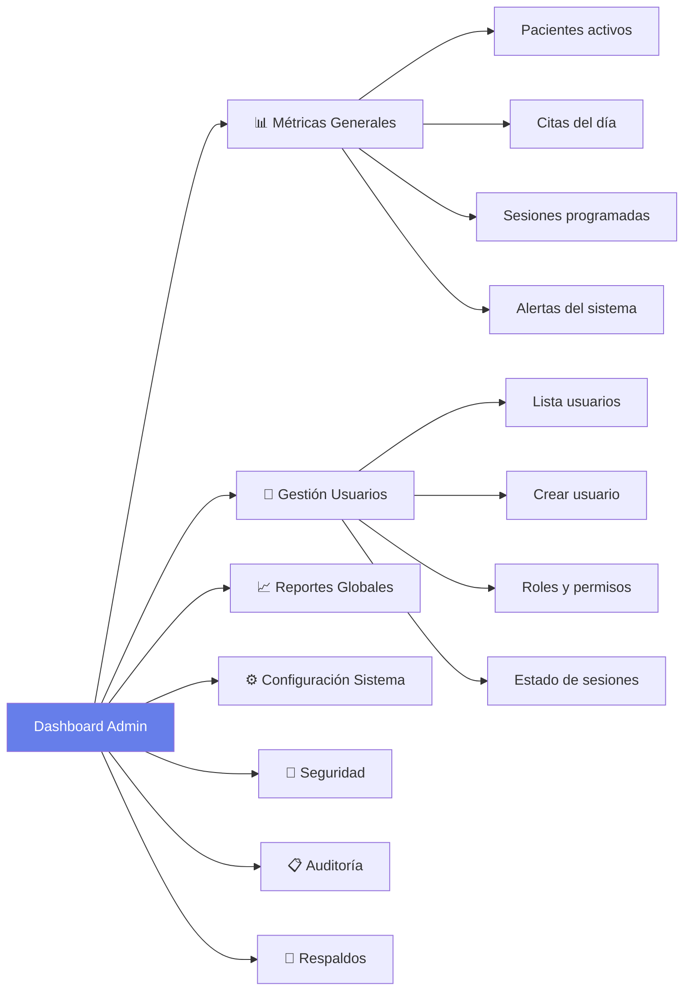
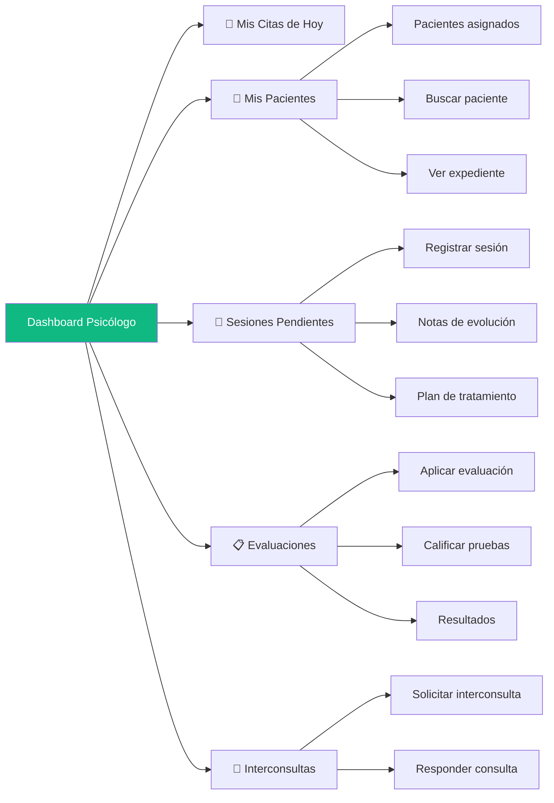
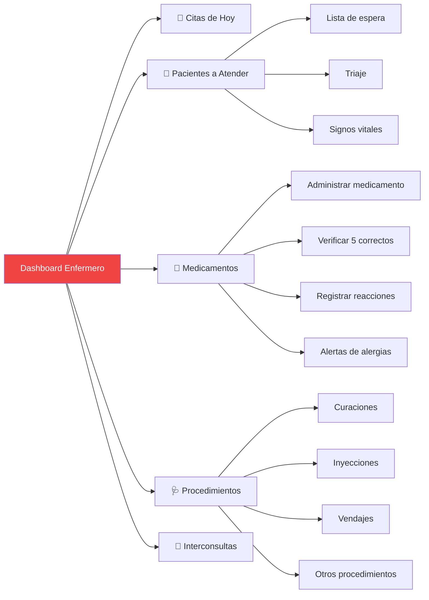
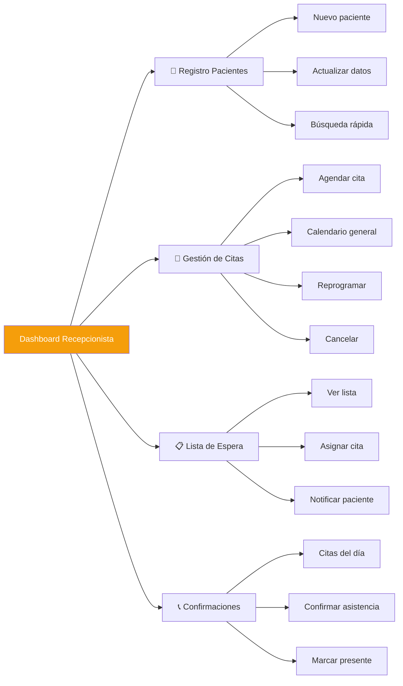
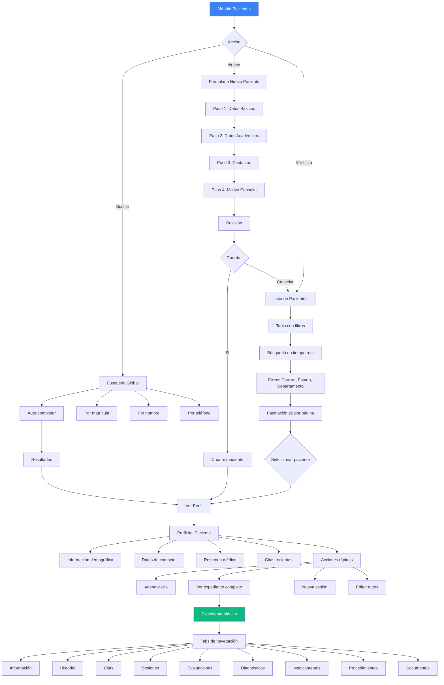
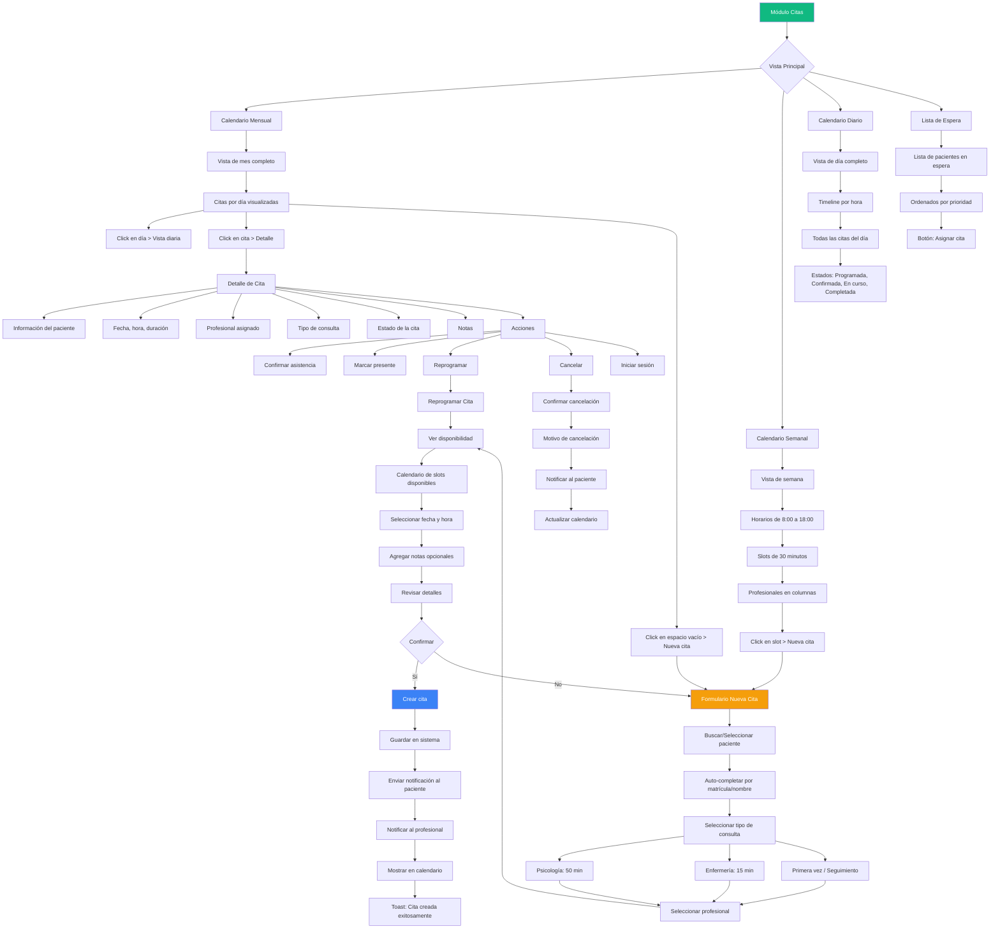
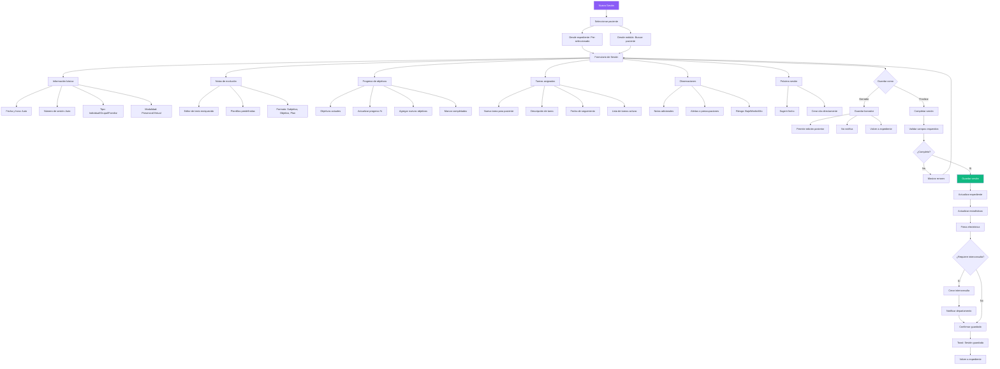
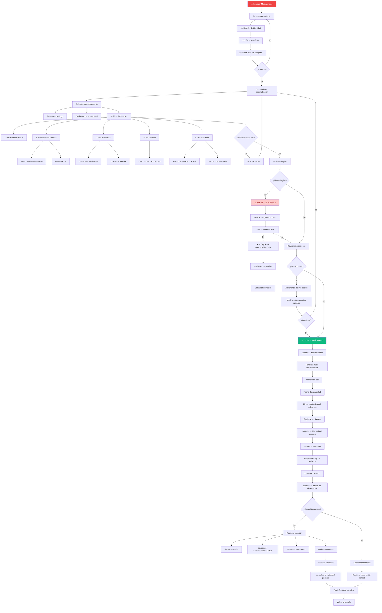

# 🗺️ FLUJO DE NAVEGACIÓN COMPLETO - SISTEMA EHR

## Sistema de Registro de Salud Electrónico

---

**Versión:** 1.0  
**Fecha:** 14 de Febrero, 2026  
**Departamentos:** Enfermería y Psicología  
**Estado:** ✅ Aprobado para Desarrollo

---

## 🎯 PROPÓSITO

Este documento define el flujo de navegación completo del Sistema de Registro de Salud Electrónico (EHR), documentando todas las pantallas principales, sus interacciones, y la experiencia de navegación del usuario. Sirve como guía autoritativa para el desarrollo, pruebas y validación de la arquitectura de información del sistema.

---

## 📋 TABLA DE CONTENIDOS

1. [Arquitectura de Navegación](#-arquitectura-de-navegación)
2. [Diagrama de Flujo Principal](#-diagrama-de-flujo-principal)
3. [Navegación por Rol de Usuario](#-navegación-por-rol-de-usuario)
4. [Flujos Detallados por Módulo](#-flujos-detallados-por-módulo)
5. [Patrones de Navegación](#-patrones-de-navegación)
6. [Estados y Transiciones](#-estados-y-transiciones)
7. [Accesibilidad y Atajos](#-accesibilidad-y-atajos)
8. [Validación y Criterios](#-validación-y-criterios)

---

## 🏗️ ARQUITECTURA DE NAVEGACIÓN

### Estructura Jerárquica de Rutas

```
Sistema EHR
│
├── 🔐 Autenticación (Público)
│   ├── /login
│   ├── /forgot-password
│   └── /reset-password/:token
│
└── 🏥 Aplicación Principal (Autenticado)
    │
    ├── 📊 Dashboard (/)
    │   ├── /dashboard/admin
    │   ├── /dashboard/psychologist
    │   ├── /dashboard/nurse
    │   └── /dashboard/receptionist
    │
    ├── 👥 Gestión de Pacientes (/patients)
    │   ├── /patients                    # Lista
    │   ├── /patients/new                # Crear nuevo
    │   ├── /patients/:id                # Vista general
    │   ├── /patients/:id/edit           # Editar datos
    │   └── /patients/:id/record         # Expediente médico
    │       ├── /record/info             # Información general
    │       ├── /record/history          # Historial completo
    │       ├── /record/appointments     # Citas del paciente
    │       ├── /record/sessions         # Sesiones terapéuticas
    │       ├── /record/evaluations      # Evaluaciones psicométricas
    │       ├── /record/diagnoses        # Diagnósticos
    │       ├── /record/medications      # Medicamentos
    │       ├── /record/procedures       # Procedimientos
    │       └── /record/documents        # Documentos adjuntos
    │
    ├── 📅 Gestión de Citas (/appointments)
    │   ├── /appointments/calendar       # Calendario principal
    │   │   ├── /calendar/month          # Vista mensual
    │   │   ├── /calendar/week           # Vista semanal
    │   │   └── /calendar/day            # Vista diaria
    │   ├── /appointments/new            # Nueva cita
    │   ├── /appointments/:id            # Detalle de cita
    │   ├── /appointments/:id/edit       # Editar cita
    │   ├── /appointments/:id/reschedule # Reprogramar
    │   ├── /appointments/waiting-list   # Lista de espera
    │   └── /appointments/confirmations  # Confirmaciones pendientes
    │
    ├── 📝 Sesiones Terapéuticas (/sessions)
    │   ├── /sessions                    # Lista de sesiones
    │   ├── /sessions/new                # Nueva sesión
    │   ├── /sessions/:id                # Detalle de sesión
    │   ├── /sessions/:id/edit           # Editar sesión
    │   └── /sessions/templates          # Plantillas de notas
    │
    ├── 💊 Gestión de Medicamentos (/medications)
    │   ├── /medications                 # Catálogo
    │   ├── /medications/administration  # Registro de administración
    │   ├── /medications/history/:patientId  # Historial por paciente
    │   ├── /medications/alerts          # Alertas y recordatorios
    │   └── /medications/inventory       # Control de inventario
    │
    ├── 🩺 Procedimientos de Enfermería (/procedures)
    │   ├── /procedures                  # Lista de procedimientos
    │   ├── /procedures/new              # Nuevo procedimiento
    │   ├── /procedures/:id              # Detalle
    │   └── /procedures/:id/edit         # Editar
    │
    ├── 🔄 Interconsultas (/consultations)
    │   ├── /consultations               # Bandeja de entrada
    │   ├── /consultations/sent          # Enviadas
    │   ├── /consultations/received      # Recibidas
    │   ├── /consultations/new           # Nueva interconsulta
    │   ├── /consultations/:id           # Detalle
    │   └── /consultations/:id/respond   # Responder
    │
    ├── 📊 Reportes y Estadísticas (/reports)
    │   ├── /reports                     # Generador de reportes
    │   ├── /reports/templates           # Plantillas
    │   ├── /reports/statistics          # Estadísticas generales
    │   ├── /reports/preview/:id         # Vista previa
    │   └── /reports/export              # Exportación de datos
    │
    ├── 📋 Evaluaciones Psicométricas (/evaluations)
    │   ├── /evaluations                 # Lista de evaluaciones
    │   ├── /evaluations/new             # Nueva evaluación
    │   ├── /evaluations/:id             # Resultados
    │   ├── /evaluations/:id/score       # Calificar
    │   └── /evaluations/templates       # Plantillas (Wizz, Beck, etc.)
    │
    ├── 🔔 Notificaciones (/notifications)
    │   ├── /notifications               # Centro de notificaciones
    │   ├── /notifications/settings      # Configuración
    │   └── /notifications/:id           # Detalle de notificación
    │
    ├── ⚙️ Administración (/admin)
    │   ├── /admin/users                 # Gestión de usuarios
    │   │   ├── /users                   # Lista
    │   │   ├── /users/new               # Nuevo usuario
    │   │   ├── /users/:id               # Perfil
    │   │   └── /users/:id/edit          # Editar
    │   ├── /admin/roles                 # Roles y permisos
    │   ├── /admin/settings              # Configuración del sistema
    │   │   ├── /settings/general        # Configuración general
    │   │   ├── /settings/security       # Seguridad
    │   │   ├── /settings/notifications  # Notificaciones
    │   │   └── /settings/backup         # Respaldos
    │   ├── /admin/audit-logs            # Logs de auditoría
    │   └── /admin/system-health         # Salud del sistema
    │
    ├── 👤 Perfil de Usuario (/profile)
    │   ├── /profile                     # Mi perfil
    │   ├── /profile/edit                # Editar perfil
    │   ├── /profile/settings            # Configuración personal
    │   └── /profile/change-password     # Cambiar contraseña
    │
    └── ❓ Ayuda y Soporte (/help)
        ├── /help                        # Centro de ayuda
        ├── /help/guides                 # Guías de usuario
        ├── /help/faq                    # Preguntas frecuentes
        └── /help/contact                # Contactar soporte
```

---

## 🗺️ DIAGRAMA DE FLUJO PRINCIPAL

### Navegación Global del Sistema

```mermaid
graph TB
    Start([Usuario accede al sistema]) --> Login[🔐 Pantalla de Login]
    
    Login --> Auth{¿Autenticado?}
    Auth -->|No| Login
    Auth -->|Sí| FirstLogin{¿Primer login?}
    
    FirstLogin -->|Sí| ChangePass[🔑 Cambiar contraseña]
    ChangePass --> RoleCheck
    FirstLogin -->|No| RoleCheck{Determinar rol}
    
    RoleCheck -->|Administrador| AdminDash[📊 Dashboard Admin]
    RoleCheck -->|Psicólogo| PsyDash[📊 Dashboard Psicólogo]
    RoleCheck -->|Enfermero| NurseDash[📊 Dashboard Enfermero]
    RoleCheck -->|Recepcionista| RecepDash[📊 Dashboard Recepcionista]
    
    AdminDash --> Nav[🎯 Navegación Principal]
    PsyDash --> Nav
    NurseDash --> Nav
    RecepDash --> Nav
    
    Nav --> Patients[👥 Módulo Pacientes]
    Nav --> Appointments[📅 Módulo Citas]
    Nav --> Sessions[📝 Módulo Sesiones]
    Nav --> Meds[💊 Módulo Medicamentos]
    Nav --> Procedures[🩺 Módulo Procedimientos]
    Nav --> Consults[🔄 Módulo Interconsultas]
    Nav --> Reports[📊 Módulo Reportes]
    Nav --> Evals[📋 Módulo Evaluaciones]
    Nav --> Notifs[🔔 Notificaciones]
    Nav --> Admin[⚙️ Administración]
    Nav --> Profile[👤 Mi Perfil]
    Nav --> Help[❓ Ayuda]
    
    Patients --> PList[Lista de Pacientes]
    Patients --> PNew[Nuevo Paciente]
    Patients --> PView[Ver Paciente]
    PView --> PRecord[Expediente Médico]
    
    Appointments --> ACalendar[Calendario]
    Appointments --> ANew[Nueva Cita]
    Appointments --> AWait[Lista de Espera]
    
    Sessions --> SList[Lista Sesiones]
    Sessions --> SNew[Nueva Sesión]
    
    Meds --> MList[Catálogo]
    Meds --> MAdmin[Administración]
    Meds --> MAlerts[Alertas]
    
    Procedures --> ProcList[Lista Procedimientos]
    Procedures --> ProcNew[Nuevo Procedimiento]
    
    Consults --> CInbox[Bandeja de Entrada]
    Consults --> CNew[Nueva Interconsulta]
    
    Reports --> RGen[Generador]
    Reports --> RStats[Estadísticas]
    
    Evals --> EList[Lista Evaluaciones]
    Evals --> ENew[Nueva Evaluación]
    
    Notifs --> NCenter[Centro Notificaciones]
    
    Admin --> AUsers[Usuarios]
    Admin --> ARoles[Roles]
    Admin --> ASettings[Configuración]
    Admin --> ALogs[Logs Auditoría]
    
    Profile --> PView2[Ver Perfil]
    Profile --> PEdit[Editar Perfil]
    Profile --> PPass[Cambiar Contraseña]
    
    Help --> HGuides[Guías]
    Help --> HFAQ[FAQ]
    
    style Start fill:#e1f5e1
    style Login fill:#e1f0ff
    style Nav fill:#fff4e1
    style Patients fill:#ffe1e1
    style Appointments fill:#e1ffe1
    style Sessions fill:#f0e1ff
```



---

## 👥 NAVEGACIÓN POR ROL DE USUARIO

### 1. 👔 Administrador

**Acceso completo a todas las funcionalidades del sistema**



**Menú de navegación:**
- 📊 Dashboard
- 👥 Pacientes (Ver todos)
- 📅 Citas (Ver todas)
- 📝 Sesiones (Ver todas)
- 💊 Medicamentos
- 🔄 Interconsultas
- 📊 Reportes (Todos)
- ⚙️ Administración
  - Usuarios
  - Roles
  - Configuración
  - Logs
  - Salud del sistema
- 🔔 Notificaciones
- 👤 Mi Perfil
- ❓ Ayuda

---

### 2. 👨‍⚕️ Psicólogo

**Enfocado en atención psicológica y sesiones terapéuticas**



**Menú de navegación:**
- 📊 Mi Dashboard
- 👥 Pacientes
  - Mis pacientes
  - Buscar paciente
  - Expedientes
- 📅 Mis Citas
  - Calendario personal
  - Citas de hoy
  - Próximas citas
- 📝 Sesiones
  - Nueva sesión
  - Sesiones recientes
  - Plantillas
- 📋 Evaluaciones
  - Nueva evaluación
  - Calificar
  - Resultados
- 🔄 Interconsultas
  - Recibidas
  - Enviadas
  - Nueva
- 📊 Mis Reportes
- 🔔 Notificaciones
- 👤 Mi Perfil
- ❓ Ayuda

---

### 3. 👩‍⚕️ Enfermero/a

**Enfocado en atención de enfermería y procedimientos**



**Menú de navegación:**
- 📊 Mi Dashboard
- 👥 Pacientes
  - Lista de pacientes
  - Buscar paciente
  - Registro rápido
- 📅 Citas
  - Mis citas
  - Lista de espera
- 💊 Medicamentos
  - Administración
  - Historial
  - Alertas
  - Inventario
- 🩺 Procedimientos
  - Nuevo procedimiento
  - Registros recientes
- 🔄 Interconsultas
  - Recibidas
  - Solicitar
- 📊 Reportes
  - Procedimientos
  - Medicamentos
- 🔔 Notificaciones
- 👤 Mi Perfil
- ❓ Ayuda

---

### 4. 📋 Recepcionista

**Enfocado en registro de pacientes y agendamiento**



**Menú de navegación:**
- 📊 Mi Dashboard
- 👥 Pacientes
  - Nuevo paciente
  - Lista completa
  - Buscar
  - Actualizar datos
- 📅 Citas
  - Calendario
  - Nueva cita
  - Reprogramar
  - Lista de espera
  - Confirmaciones
- 📊 Reportes básicos
  - Citas programadas
  - Asistencias
- 🔔 Notificaciones
- 👤 Mi Perfil
- ❓ Ayuda

---

## 📱 FLUJOS DETALLADOS POR MÓDULO

### Módulo 1: Gestión de Pacientes

#### Flujo Principal de Pacientes



#### Navegación dentro del Expediente Médico

**Tabs horizontales con contenido dinámico:**

1. **📋 Información General**
   - Datos demográficos
   - Contactos de emergencia
   - Información académica
   - Tutor (si aplica)

2. **📖 Historial Completo**
   - Timeline de eventos
   - Todas las sesiones
   - Todos los procedimientos
   - Interconsultas
   - Vista cronológica

3. **📅 Citas**
   - Calendario de citas del paciente
   - Historial de asistencias
   - Citas programadas
   - Botón: Nueva cita

4. **📝 Sesiones Terapéuticas**
   - Lista de sesiones
   - Notas de evolución
   - Planes de tratamiento
   - Objetivos terapéuticos
   - Botón: Nueva sesión

5. **📋 Evaluaciones Psicométricas**
   - Evaluaciones aplicadas
   - Resultados e interpretación
   - Gráficas de evolución
   - Botón: Nueva evaluación

6. **🏷️ Diagnósticos**
   - Diagnósticos actuales
   - Historial de diagnósticos
   - DSM-5 / CIE-10/11
   - Nivel de severidad

7. **💊 Medicamentos**
   - Medicamentos actuales
   - Historial de administración
   - Alergias conocidas
   - Reacciones adversas

8. **🩺 Procedimientos**
   - Procedimientos de enfermería
   - Curaciones
   - Inyecciones
   - Otros tratamientos

9. **📎 Documentos**
   - Documentos adjuntos
   - Resultados de laboratorio
   - Imágenes médicas
   - Consentimientos

---

### Módulo 2: Gestión de Citas

#### Flujo Principal de Citas



---

### Módulo 3: Sesiones Terapéuticas

#### Flujo de Registro de Sesión



---

### Módulo 4: Medicamentos

#### Flujo de Administración de Medicamentos



---

## 🎨 PATRONES DE NAVEGACIÓN

### 1. Navegación Principal (Sidebar)

**Estructura:**
```
┌─────────────────────────────────┐
│ [LOGO]                          │
│                                 │
│ 🏠 Dashboard                    │
│ 👥 Pacientes                 ▼  │
│   • Lista de pacientes          │
│   • Nuevo paciente              │
│   • Búsqueda                    │
│ 📅 Citas                     ▼  │
│   • Calendario                  │
│   • Nueva cita                  │
│   • Lista de espera             │
│ 📝 Sesiones                  ▼  │
│   • Nueva sesión                │
│   • Mis sesiones                │
│ 💊 Medicamentos              ▼  │
│ 🩺 Procedimientos            ▼  │
│ 🔄 Interconsultas            ▼  │
│ 📊 Reportes                  ▼  │
│ ⚙️ Administración (Admin)    ▼  │
│                                 │
│ ─────────────────────────────── │
│ 🔔 Notificaciones (3)           │
│ 👤 Mi Perfil                    │
│ 🚪 Cerrar Sesión                │
└─────────────────────────────────┘
```

**Comportamiento:**
- Sidebar colapsable con botón toggle
- Menús desplegables con ▼
- Indicador de sección activa (color primario)
- Badge de notificaciones en tiempo real
- Búsqueda global en top bar
- Breadcrumbs en contenido principal

---

### 2. Navegación con Tabs

**Usado en:**
- Expediente del paciente
- Configuración del sistema
- Perfil de usuario
- Vista de reportes

**Estructura:**
```
┌─────────────────────────────────────────────────────┐
│ [Información] [Historial] [Citas] [Sesiones] [...]  │
└─────────────────────────────────────────────────────┘
│                                                     │
│         Contenido del tab seleccionado             │
│                                                     │
```

**Características:**
- Tabs horizontales con scroll si no caben
- Tab activo resaltado con borde inferior
- Contenido se carga dinámicamente
- URL refleja el tab activo: `/patients/:id/record/sessions`
- Navegación con teclado: ← →

---

### 3. Modal de Navegación

**Usado para:**
- Formularios de creación rápida
- Confirmaciones
- Vistas de detalle rápido
- Selección de opciones

**Ejemplo: Modal de Nueva Cita**
```
┌───────────────────────────────────────┐
│ Nueva Cita                        [X] │
├───────────────────────────────────────┤
│                                       │
│ [Formulario de cita]                  │
│                                       │
│ Pasos:                                │
│ ● Paciente                            │
│ ○ Fecha y Hora                        │
│ ○ Tipo                                │
│ ○ Confirmación                        │
│                                       │
│        [Cancelar]  [Siguiente >]      │
└───────────────────────────────────────┘
```

**Comportamiento:**
- Overlay oscuro (backdrop)
- Cerrar con ESC, click en overlay, o botón X
- Multi-paso con indicador de progreso
- Validación antes de avanzar
- No se puede navegar fuera sin cerrar

---

### 4. Breadcrumbs (Migas de Pan)

**Estructura:**
```
🏠 Inicio > 👥 Pacientes > Juan Pérez > 📋 Expediente > 📝 Sesiones
```

**Comportamiento:**
- Siempre visible en top bar
- Cada nivel es clickeable
- Nivel actual no es clickeable
- Muestra máximo 5 niveles
- Si hay más niveles: `... > Nivel 4 > Nivel 5`

**Ejemplos:**
- `Dashboard > Pacientes > Lista`
- `Dashboard > Pacientes > María García > Expediente > Nueva Sesión`
- `Dashboard > Citas > Calendario > Nueva Cita`
- `Dashboard > Administración > Usuarios > Nuevo Usuario`

---

### 5. Navegación Contextual

**Botones de Acción Flotantes (FAB):**
- Ubicación: Esquina inferior derecha
- Usado en vistas de lista
- Acción principal del módulo
- Ejemplos:
  - Lista de pacientes: `[+] Nuevo Paciente`
  - Calendario: `[+] Nueva Cita`
  - Sesiones: `[+] Nueva Sesión`

**Acciones Rápidas:**
- En cards y filas de tabla
- Iconos de acción al hacer hover
- Menú contextual con click derecho
- Ejemplos:
  - 👁️ Ver
  - ✏️ Editar
  - 🗑️ Eliminar
  - 📄 Imprimir
  - 📤 Exportar

---

## 🔄 ESTADOS Y TRANSICIONES

### Estados de Pantalla

#### 1. Estado de Carga (Loading)

**Skeleton Screens:**
```
┌─────────────────────────────────────┐
│ ████████░░░░░░░░░░░░░░░░░░░░░░     │ ← Animación shimmer
│ ██████░░░░░░░░░░░░░░░░░░           │
│                                     │
│ ████████████████░░░░░░░░░░         │
│ ██████████░░░░░░░░░░░░░░░░         │
└─────────────────────────────────────┘
```

**Spinners:**
- Spinner de página completa
- Spinner en botones
- Spinner en secciones

**Duración esperada:**
- < 1 segundo: Sin indicador
- 1-3 segundos: Spinner simple
- > 3 segundos: Skeleton + mensaje de progreso

---

#### 2. Estado Vacío (Empty State)

**Cuando no hay datos:**
```
┌─────────────────────────────────────┐
│                                     │
│          📋 [Ilustración]           │
│                                     │
│       No hay sesiones aún           │
│                                     │
│  Comienza registrando la primera    │
│  sesión terapéutica del paciente    │
│                                     │
│      [+ Nueva Sesión]               │
│                                     │
└─────────────────────────────────────┘
```

**Elementos:**
- Ilustración o ícono grande
- Mensaje descriptivo
- Texto de ayuda
- Acción primaria (CTA)

---

#### 3. Estado de Error

**Tipos de errores:**

**Error de Conexión:**
```
┌─────────────────────────────────────┐
│         ⚠️ Sin conexión             │
│                                     │
│  No se pudo conectar al servidor    │
│                                     │
│      [🔄 Reintentar]                │
└─────────────────────────────────────┘
```

**Error 404 - No Encontrado:**
```
┌─────────────────────────────────────┐
│         404                         │
│    Página no encontrada             │
│                                     │
│  La página que buscas no existe     │
│                                     │
│   [← Volver al Dashboard]           │
└─────────────────────────────────────┘
```

**Error 403 - Sin Permiso:**
```
┌─────────────────────────────────────┐
│         🔒 Acceso Denegado          │
│                                     │
│ No tienes permisos para ver esto    │
│                                     │
│   [← Volver]                        │
└─────────────────────────────────────┘
```

---

#### 4. Estado de Éxito

**Confirmaciones:**
```
Toast Notification (top-right):
┌─────────────────────────────────────┐
│ ✅ Sesión guardada exitosamente     │
└─────────────────────────────────────┘
Auto-dismiss en 5 segundos
```

**Feedback en página:**
```
┌─────────────────────────────────────┐
│ ✅ ¡Paciente registrado!            │
│                                     │
│ El expediente de María García       │
│ ha sido creado exitosamente         │
│                                     │
│ [Ver Expediente] [Crear Otro]       │
└─────────────────────────────────────┘
```

---

### Transiciones entre Pantallas

**Fade In/Out:**
- Duración: 200ms
- Usado en: Cambio de páginas principales

**Slide:**
- Duración: 300ms
- Usado en: Modals, sidebars, drawers

**Scale:**
- Duración: 200ms
- Usado en: Tooltips, dropdowns

**No Animation:**
- Tabs dentro de la misma vista
- Contenido dinámico dentro de la misma página

---

## ⌨️ ACCESIBILIDAD Y ATAJOS

### Atajos de Teclado

**Globales:**
- `Ctrl/Cmd + K`: Búsqueda global
- `Ctrl/Cmd + B`: Toggle sidebar
- `Ctrl/Cmd + /`: Mostrar ayuda de atajos
- `Esc`: Cerrar modal/dropdown activo
- `Alt + N`: Notificaciones
- `Alt + P`: Mi perfil

**Navegación:**
- `Tab`: Siguiente elemento
- `Shift + Tab`: Elemento anterior
- `Enter`: Activar botón/link
- `Space`: Checkbox/radio
- `↑ ↓`: Navegación en listas
- `← →`: Navegación en tabs

**Módulos:**
- `Ctrl + N`: Nuevo (paciente, cita, sesión según contexto)
- `Ctrl + S`: Guardar formulario
- `Ctrl + E`: Editar
- `Ctrl + P`: Imprimir
- `Ctrl + F`: Buscar en página

**Calendario:**
- `T`: Ver hoy
- `N`: Siguiente (día/semana/mes)
- `P`: Anterior (día/semana/mes)
- `D`: Vista diaria
- `W`: Vista semanal
- `M`: Vista mensual

---

### Navegación por Teclado

**Orden de tabulación lógico:**
1. Búsqueda global
2. Navegación principal (sidebar)
3. Contenido principal
4. Acciones secundarias

**Focus visible:**
- Outline de 2px con color primario
- Contraste mínimo 3:1
- Nunca remover el outline

**Skip links:**
```
[Saltar al contenido principal]
[Saltar a navegación]
[Saltar a búsqueda]
```

---

### Lectores de Pantalla

**ARIA Labels:**
- Todos los botones tienen aria-label
- Formularios con labels asociados
- Regiones con aria-landmarks
- Estados dinámicos con aria-live

**Estructura semántica:**
```html
<nav aria-label="Navegación principal">
<main aria-label="Contenido principal">
<aside aria-label="Información complementaria">
<header>
<footer>
```

**Anuncios:**
- Mensajes de éxito: `aria-live="polite"`
- Errores: `aria-live="assertive"`
- Notificaciones: `role="alert"`

---

## ✅ VALIDACIÓN Y CRITERIOS

### Criterios de Aceptación

#### ✅ Diagrama de Flujo Completo

**Cumplido:**
- [x] Diagrama principal con Mermaid
- [x] Todos los módulos documentados
- [x] Flujos por rol de usuario
- [x] Navegación detallada por módulo
- [x] Estados y transiciones

#### ✅ Descripciones Claras

**Cumplido:**
- [x] Cada pantalla descrita
- [x] Pasos de navegación explicados
- [x] Interacciones documentadas
- [x] Comportamientos especificados

#### ✅ Accesibilidad

**Cumplido:**
- [x] Documento en formato Markdown
- [x] Ubicado en `/documents`
- [x] Fácil de encontrar y leer
- [x] Versionado en Git

#### ✅ Validación del Equipo

**Pendiente:**
- [ ] Revisión por desarrolladores frontend
- [ ] Validación de UX/UI designers
- [ ] Aprobación de stakeholders
- [ ] Feedback incorporado

---

### Checklist de Completitud

**Cobertura de Módulos:**
- [x] Autenticación
- [x] Dashboard (4 roles)
- [x] Gestión de Pacientes
- [x] Gestión de Citas
- [x] Sesiones Terapéuticas
- [x] Medicamentos
- [x] Procedimientos de Enfermería
- [x] Interconsultas
- [x] Reportes
- [x] Evaluaciones Psicométricas
- [x] Notificaciones
- [x] Administración
- [x] Perfil de Usuario
- [x] Ayuda y Soporte

**Elementos Documentados:**
- [x] Estructura de rutas completa
- [x] Diagramas de flujo (Mermaid)
- [x] Navegación por rol
- [x] Patrones de navegación
- [x] Estados de pantalla
- [x] Transiciones
- [x] Atajos de teclado
- [x] Accesibilidad
- [x] Breadcrumbs
- [x] Modals y componentes

---

## 📊 MÉTRICAS DE NAVEGACIÓN

### Indicadores Clave

**Eficiencia de Navegación:**
- Clicks promedio para tarea común: < 3 clicks
- Tiempo para encontrar un paciente: < 10 segundos
- Tiempo para agendar una cita: < 2 minutos
- Tiempo para registrar sesión: < 5 minutos

**Usabilidad:**
- Tasa de éxito en navegación: > 95%
- Tasa de uso de búsqueda global: > 60%
- Tasa de uso de atajos: > 30% (usuarios avanzados)

**Accesibilidad:**
- Navegación completa por teclado: 100%
- Compatibilidad con lectores de pantalla: 100%
- Contraste de color: WCAG AA mínimo

---

## 🔄 ACTUALIZACIONES Y MANTENIMIENTO

### Versionamiento

**Versión Actual:** 1.0  
**Fecha de Creación:** 14 de Febrero, 2026  
**Última Actualización:** 14 de Febrero, 2026

### Historial de Cambios

**v1.0 (14/02/2026)**
- ✅ Creación del documento completo
- ✅ Arquitectura de navegación definida
- ✅ Diagramas de flujo para todos los módulos
- ✅ Navegación por rol de usuario
- ✅ Patrones de navegación documentados
- ✅ Accesibilidad y atajos incluidos

### Próximas Actualizaciones

**v1.1 (Planificada)**
- [ ] Incorporar feedback del equipo de desarrollo
- [ ] Agregar ejemplos visuales (screenshots)
- [ ] Documentar flujos de error en detalle
- [ ] Agregar casos de uso específicos

---

## 📚 REFERENCIAS

### Documentos Relacionados

- **[Requisitos Funcionales](./Req-Funcionales.md)** - Funcionalidades del sistema
- **[Wireframes](./design/wireframes/README.md)** - Diseños de baja fidelidad
- **[Mockups](./design/mockups/README.md)** - Diseños de alta fidelidad
- **[Prototipos](./design/prototypes/README.md)** - Flujos interactivos
- **[Diagrama de Flujo de Atención](./Diagrama-Flujo-Atencion.md)** - Proceso clínico
- **[Reglas de Negocio](./Reglas-Negocio.md)** - Lógica de negocio

### Estándares y Guías

- **WCAG 2.1 AA** - Accesibilidad web
- **Material Design 3** - Patrones de navegación
- **Nielsen Norman Group** - Heurísticas de usabilidad
- **HIPAA** - Seguridad en sistemas de salud

---

## 👥 RESPONSABLES Y CONTACTO

### Equipo de Diseño

**UX/UI Designer:** Responsable del flujo de navegación  
**Frontend Lead:** Implementación de navegación  
**QA Lead:** Validación y testing de navegación

### Contacto

Para consultas sobre este documento:
- **GitHub Issues:** Reportar problemas o sugerencias
- **Email:** design@ehr-system.com
- **Meetings:** Revisiones semanales del equipo

---

## ✅ APROBACIONES

### Revisión y Aprobación

| Rol | Nombre | Fecha | Estado |
|-----|--------|-------|--------|
| UX/UI Designer | - | - | ⏳ Pendiente |
| Frontend Lead | - | - | ⏳ Pendiente |
| Product Owner | - | - | ⏳ Pendiente |
| Tech Lead | - | - | ⏳ Pendiente |

### Notas de Aprobación

_Este espacio se llenará durante el proceso de revisión_

---

## 📝 NOTAS FINALES

### Para Desarrolladores

Este documento debe ser la **fuente de verdad** para la implementación de la navegación en el sistema EHR. Cualquier desviación debe ser:

1. Discutida con el equipo
2. Documentada como cambio
3. Aprobada por stakeholders
4. Actualizada en este documento

### Para Diseñadores

Este flujo de navegación está alineado con:
- Los wireframes aprobados
- El sistema de diseño establecido
- Las mejores prácticas de UX
- Los requisitos funcionales

### Para QA

Use este documento para:
- Crear casos de prueba de navegación
- Validar flujos de usuario
- Verificar accesibilidad
- Confirmar estados y transiciones

---

<div align="center">

## 🎯 RESUMEN EJECUTIVO

Este documento define el flujo de navegación completo del Sistema EHR, cubriendo:

✅ **44 pantallas principales** documentadas  
✅ **4 roles de usuario** con navegación específica  
✅ **10+ módulos funcionales** con flujos detallados  
✅ **Patrones de navegación** consistentes  
✅ **Accesibilidad completa** incluida  

El sistema está diseñado para ser:
- **Intuitivo:** Navegación clara y lógica
- **Eficiente:** Mínimos clicks para tareas comunes
- **Accesible:** Compatible con lectores de pantalla y teclado
- **Escalable:** Fácil de extender con nuevos módulos

---

**📄 Documento Completo y Listo para Desarrollo**

**Sistema de Registro de Salud Electrónico**  
Departamento de Psicología y Enfermería

*Diseñado con ❤️ para mejorar la atención en salud*

[🏠 Inicio](../README.md) • [📚 Documentación](./README.md) • [🎨 Diseño](./design/README.md)

</div>
