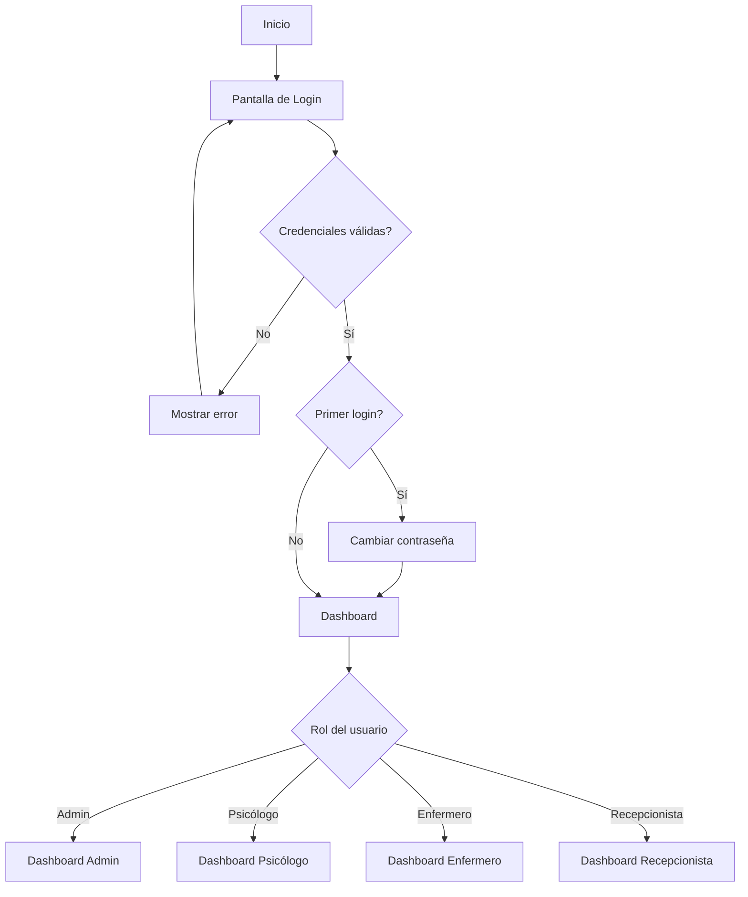
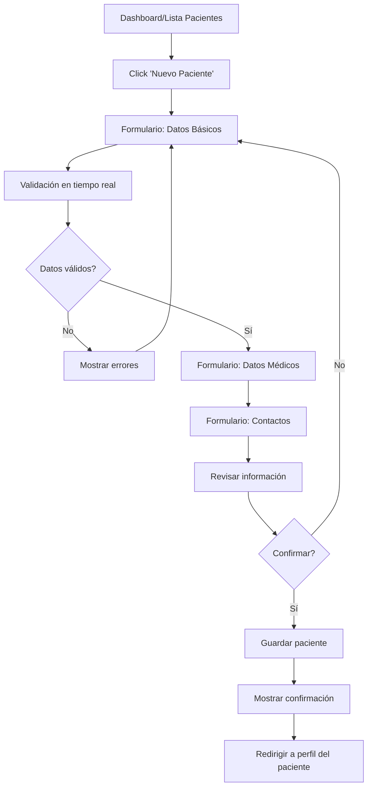
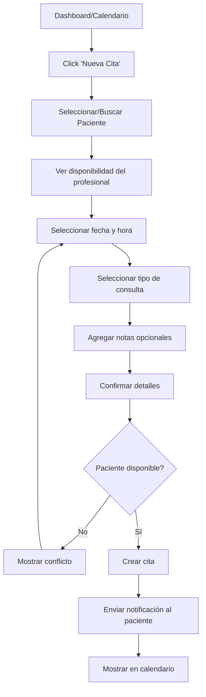
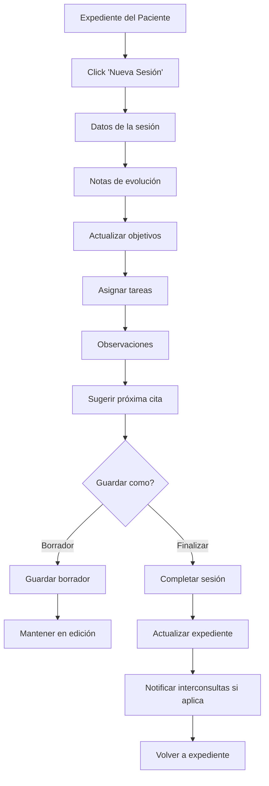
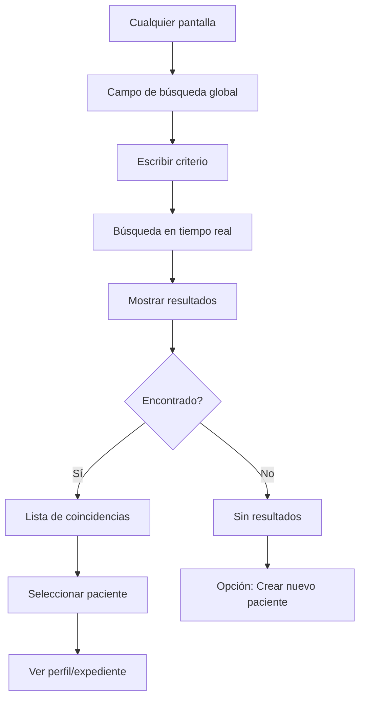
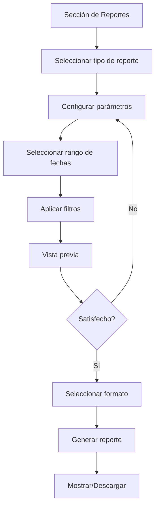

# 🎬 Prototipos Interactivos - Sistema EHR

## 📋 Descripción

Documentación de prototipos interactivos y flujos de usuario para el Sistema de Registro de Salud Electrónico. Define cómo los usuarios interactúan con el sistema y navegan entre pantallas.

## 🎯 Objetivos

- **Validar flujos**: Comprobar que los usuarios pueden completar tareas críticas
- **Identificar problemas**: Detectar puntos de fricción antes del desarrollo
- **Comunicar interacciones**: Documentar comportamientos dinámicos
- **Guiar desarrollo**: Proporcionar especificaciones claras de funcionalidad

---

## 🗺️ Arquitectura de Navegación

### Estructura de Rutas

```
/
├── /login                    # Autenticación
├── /forgot-password         # Recuperación de contraseña
│
├── /dashboard               # Dashboard principal (según rol)
│   ├── /admin              # Vista de administrador
│   ├── /psychologist       # Vista de psicólogo
│   ├── /nurse              # Vista de enfermero
│   └── /receptionist       # Vista de recepcionista
│
├── /patients                # Gestión de pacientes
│   ├── /                   # Lista de pacientes
│   ├── /new                # Nuevo paciente
│   ├── /:id                # Perfil de paciente
│   ├── /:id/edit           # Editar paciente
│   └── /:id/record         # Expediente médico
│       ├── /info           # Información general
│       ├── /history        # Historial de sesiones
│       ├── /appointments   # Citas
│       ├── /evaluations    # Evaluaciones
│       ├── /diagnoses      # Diagnósticos
│       ├── /medications    # Medicamentos
│       └── /documents      # Documentos
│
├── /appointments            # Gestión de citas
│   ├── /calendar           # Vista de calendario
│   │   ├── /month         # Vista mensual
│   │   ├── /week          # Vista semanal
│   │   └── /day           # Vista diaria
│   ├── /new               # Nueva cita
│   ├── /:id/edit          # Editar cita
│   └── /waiting-list      # Lista de espera
│
├── /sessions                # Sesiones terapéuticas
│   ├── /new               # Nueva sesión
│   ├── /:id               # Detalle de sesión
│   └── /:id/edit          # Editar sesión
│
├── /medications             # Gestión de medicamentos
│   ├── /                  # Lista de medicamentos
│   ├── /administration    # Registro de administración
│   └── /alerts            # Alertas de medicamentos
│
├── /consultations           # Interconsultas
│   ├── /                  # Lista de interconsultas
│   ├── /new               # Nueva interconsulta
│   ├── /:id               # Detalle
│   └── /:id/respond       # Responder
│
├── /reports                 # Reportes y estadísticas
│   ├── /                  # Generador de reportes
│   ├── /statistics        # Estadísticas generales
│   └── /export            # Exportación de datos
│
└── /admin                   # Administración
    ├── /users             # Gestión de usuarios
    ├── /roles             # Roles y permisos
    ├── /settings          # Configuración del sistema
    └── /audit-logs        # Logs de auditoría
```

---

## 🔄 Flujos de Usuario Principales

### F-01: Autenticación



**Pasos detallados:**
1. Usuario accede a `/login`
2. Ingresa matrícula/usuario y contraseña
3. Sistema valida credenciales
4. Si es primer login → Solicita cambio de contraseña
5. Sistema carga dashboard según rol
6. Usuario ve su panel personalizado

**Tiempo estimado:** 30 segundos

---

### F-02: Registro de Nuevo Paciente



**Pasos detallados:**
1. Desde dashboard o lista, click en "Nuevo Paciente"
2. **Paso 1: Datos Básicos**
   - Nombre completo
   - Matrícula
   - Fecha de nacimiento
   - Validación en tiempo real
3. **Paso 2: Datos Académicos**
   - Carrera
   - Grupo
   - Semestre
4. **Paso 3: Datos de Contacto**
   - Teléfono
   - Email
   - Datos del tutor
5. **Paso 4: Motivo de Consulta**
   - Motivo inicial
   - Antecedentes
6. **Revisión y Confirmación**
7. Sistema guarda y muestra perfil del nuevo paciente

**Tiempo estimado:** 3-5 minutos

**Puntos de salida:**
- Click en "Cancelar" → Modal de confirmación → Volver a lista
- Click en "Guardar borrador" → Guarda progreso

---

### F-03: Agendar Cita



**Pasos detallados:**
1. Click en "Nueva Cita" o en slot vacío del calendario
2. **Buscar paciente:**
   - Por matrícula
   - Por nombre
   - Auto-completar
3. **Seleccionar profesional** (si aplicable)
4. **Ver disponibilidad:**
   - Calendario visual
   - Slots disponibles resaltados
5. **Seleccionar tipo:**
   - Psicología (50 min)
   - Enfermería (15 min)
   - Primera vez / Seguimiento
6. **Confirmar:**
   - Revisar todos los datos
   - Agregar notas si necesario
7. Sistema crea la cita
8. Envía notificación (email/SMS)
9. Actualiza calendario

**Tiempo estimado:** 1-2 minutos

---

### F-04: Registro de Sesión Terapéutica



**Pasos detallados:**
1. Desde expediente del paciente, click "Nueva Sesión"
2. **Información básica:**
   - Fecha/hora auto-rellenadas
   - Tipo de sesión (Individual/Grupal/Familiar)
   - Número de sesión
3. **Notas de evolución:**
   - Editor de texto enriquecido
   - Plantillas predefinidas opcionales
4. **Avances:**
   - Actualizar progreso de objetivos
   - Agregar nuevos objetivos
5. **Tareas asignadas:**
   - Lista de tareas para el paciente
   - Fecha de seguimiento
6. **Observaciones generales:**
   - Notas adicionales
   - Alertas o preocupaciones
7. **Próxima sesión:**
   - Sugerir fecha/hora
   - Opción de crear cita directamente
8. **Guardar:**
   - Borrador: Se puede editar después
   - Finalizar: Se completa la sesión

**Tiempo estimado:** 10-15 minutos

---

### F-05: Búsqueda de Paciente



**Criterios de búsqueda:**
- Matrícula (exacta o parcial)
- Nombre completo
- Apellido
- Teléfono
- Carrera

**Características:**
- Auto-completar
- Búsqueda difusa (tolerancia a errores)
- Resultados ordenados por relevancia
- Límite de 10 resultados iniciales
- Opción "Ver todos" si hay más

**Tiempo estimado:** 5-10 segundos

---

### F-06: Generación de Reporte



**Tipos de reportes:**
- Estadísticas de citas
- Pacientes atendidos
- Sesiones por profesional
- Medicamentos administrados
- Evaluaciones realizadas

**Pasos:**
1. Seleccionar tipo de reporte
2. Configurar:
   - Rango de fechas
   - Filtros (departamento, profesional, etc.)
   - Campos a incluir
3. Vista previa en pantalla
4. Seleccionar formato:
   - PDF
   - Excel
   - CSV
5. Generar y descargar

**Tiempo estimado:** 1-3 minutos

---

## 🎮 Interacciones y Comportamientos

### Estados de Componentes

#### Botones

**Estados:**
1. **Default**: Estado inicial
2. **Hover**: Mouse sobre el botón
   - Cambio de color (más oscuro)
   - Elevación ligera (translateY -2px)
   - Sombra aumentada
3. **Active**: Click/presionado
   - Sin elevación
   - Sombra reducida
4. **Focus**: Navegación por teclado
   - Outline visible (2px solid primary)
5. **Disabled**: No interactivo
   - Opacidad 50%
   - Cursor not-allowed
6. **Loading**: Procesando acción
   - Spinner animado
   - Texto "Procesando..."

**Duración de transición:** 200ms ease

---

#### Inputs y Formularios

**Estados:**
1. **Default**: Sin interacción
   - Border gray-300
2. **Focus**: Campo activo
   - Border primary-500
   - Box-shadow sutil
3. **Filled**: Con contenido
   - Label flotante arriba
4. **Error**: Validación fallida
   - Border error-500
   - Mensaje de error debajo
5. **Disabled**: No editable
   - Background gray-100
   - Cursor not-allowed
6. **Success**: Validación exitosa
   - Checkmark verde

**Validación:**
- En tiempo real mientras escribe
- Debounce de 300ms
- Feedback inmediato

---

#### Modals

**Comportamiento:**
1. **Apertura:**
   - Fade in del overlay (200ms)
   - Scale up del modal (0.95 → 1.0, 200ms)
   - Bloquea scroll del body
2. **Cierre:**
   - Fade out del overlay (200ms)
   - Scale down del modal (1.0 → 0.95, 200ms)
   - Restaura scroll del body
3. **Interacciones:**
   - Click en overlay → Cerrar
   - Tecla ESC → Cerrar
   - Click en botón X → Cerrar
   - Tab trap (navegación contenida)

---

#### Notificaciones (Toasts)

**Tipos:**
- Success (verde)
- Error (rojo)
- Warning (naranja)
- Info (azul)

**Comportamiento:**
1. **Aparición:**
   - Slide in desde arriba derecha
   - Duración: 300ms
2. **Permanencia:**
   - Auto-dismiss: 5 segundos
   - Hover: Pausar countdown
3. **Cierre:**
   - Slide out hacia arriba
   - Click en X: Cerrar inmediatamente
   - Duración: 300ms

**Posición:** Top-right corner

---

### Carga de Datos

#### Skeleton Loaders

**Uso:**
- Tablas cargando
- Cards cargando
- Perfiles cargando

**Comportamiento:**
- Shimmer animation (gradiente moviendo)
- Mantener estructura del componente
- Mostrar placeholders realistas

#### Spinners

**Uso:**
- Botones procesando
- Páginas cargando
- Operaciones async

**Tipos:**
- Spinner circular (primary color)
- Spinner inline (botones)
- Full-page spinner (navegación)

---

### Feedback Visual

#### Confirmaciones

**Para acciones destructivas:**
```
Modal de confirmación:
┌─────────────────────────────────┐
│ ⚠️  Confirmar acción            │
│                                 │
│ ¿Estás seguro que deseas        │
│ eliminar este paciente?         │
│                                 │
│ Esta acción no se puede         │
│ deshacer.                       │
│                                 │
│   [Cancelar]  [Sí, eliminar]   │
└─────────────────────────────────┘
```

**Tiempo de reflexión:**
- 3 segundos de espera para acciones críticas
- Botón de confirmación habilitado después

#### Progreso

**Para operaciones largas:**
- Barra de progreso con porcentaje
- Mensaje descriptivo
- Opción de cancelar si aplicable

```
Generando reporte...
[████████░░░░░░░░] 60%
Procesando datos de pacientes...
```

---

## 🎨 Animaciones

### Transiciones de Página

```javascript
// Fade transition
{
  enter: {
    opacity: 0,
    transform: 'translateY(10px)'
  },
  enterActive: {
    opacity: 1,
    transform: 'translateY(0)',
    transition: 'all 200ms ease-out'
  },
  exit: {
    opacity: 1,
    transform: 'translateY(0)'
  },
  exitActive: {
    opacity: 0,
    transform: 'translateY(-10px)',
    transition: 'all 200ms ease-in'
  }
}
```

### Micro-interacciones

1. **Botón de "Me gusta":**
   - Scale up 1.2 al click
   - Bounce back a 1.0
   - Cambio de color

2. **Agregar a favoritos:**
   - Estrella: outline → filled
   - Bounce animation
   - Color dorado

3. **Checkbox:**
   - Scale in del checkmark
   - Background color transition
   - Border → filled

4. **Toggle Switch:**
   - Slide de la bolita
   - Background color transition
   - 200ms ease-in-out

---

## 📱 Gestos y Controles Táctiles

### Gestos Móviles

1. **Swipe Left/Right:**
   - En tablas: Mostrar acciones
   - En modals: Cerrar
   - En calendario: Cambiar mes/semana

2. **Pull to Refresh:**
   - En listas de pacientes
   - En calendario
   - En dashboard

3. **Long Press:**
   - En elementos de lista: Mostrar menú contextual
   - En eventos de calendario: Editar/eliminar

4. **Pinch to Zoom:**
   - En imágenes médicas
   - En documentos

---

## 🔔 Sistema de Notificaciones

### Tipos de Notificaciones

1. **In-App (Toasts)**
   - Acciones completadas
   - Errores de validación
   - Confirmaciones

2. **Centro de Notificaciones**
   - Citas próximas
   - Interconsultas nuevas
   - Recordatorios
   - Alertas del sistema

3. **Email (Externas)**
   - Confirmación de cita
   - Recordatorio 24h antes
   - Cambio de cita

4. **Push (Futuro)**
   - Emergencias
   - Mensajes urgentes

### Prioridades

- **Urgente**: Rojo, sonido, persiste hasta cerrar
- **Alta**: Naranja, sin sonido, auto-dismiss 10s
- **Normal**: Azul, sin sonido, auto-dismiss 5s
- **Baja**: Gris, solo en centro de notificaciones

---

## ⌨️ Atajos de Teclado

### Globales

- `Ctrl/Cmd + K`: Búsqueda rápida
- `Ctrl/Cmd + /`: Mostrar atajos
- `Ctrl/Cmd + N`: Nuevo (según contexto)
- `Ctrl/Cmd + S`: Guardar
- `ESC`: Cerrar modal/drawer

### Navegación

- `G + D`: Go to Dashboard
- `G + P`: Go to Pacientes
- `G + C`: Go to Citas
- `G + R`: Go to Reportes

### Acciones

- `?`: Ayuda contextual
- `/`: Focus en búsqueda
- `N`: Nueva entidad (paciente/cita)
- `E`: Editar
- `Delete`: Eliminar (con confirmación)

---

## ✅ Checklist de Prototipos

### Flujos Principales
- [x] F-01: Autenticación - Documentado
- [x] F-02: Registro de paciente - Documentado
- [x] F-03: Agendar cita - Documentado
- [x] F-04: Registro de sesión - Documentado
- [x] F-05: Búsqueda de paciente - Documentado
- [x] F-06: Generación de reporte - Documentado
- [ ] F-07: Administración de medicamentos
- [ ] F-08: Interconsultas
- [ ] F-09: Evaluaciones psicométricas

### Interacciones
- [x] Estados de botones - Documentado
- [x] Estados de inputs - Documentado
- [x] Comportamiento de modals - Documentado
- [x] Sistema de notificaciones - Documentado
- [x] Animaciones principales - Documentado
- [ ] Gestos avanzados
- [ ] Drag & drop

### Accesibilidad
- [x] Navegación por teclado - Documentado
- [x] Focus management - Documentado
- [x] Atajos de teclado - Documentado
- [ ] Screen reader paths
- [ ] ARIA live regions

**Progreso Total**: 75% completado

---

## 📚 Referencias

- [Framer Motion](https://www.framer.com/motion/) - Animaciones
- [React Spring](https://www.react-spring.dev/) - Animaciones físicas
- [React Hot Toast](https://react-hot-toast.com/) - Notificaciones
- [React Router](https://reactrouter.com/) - Navegación

---

**Última actualización**: 2026-02-13
**Versión**: 1.0.0
