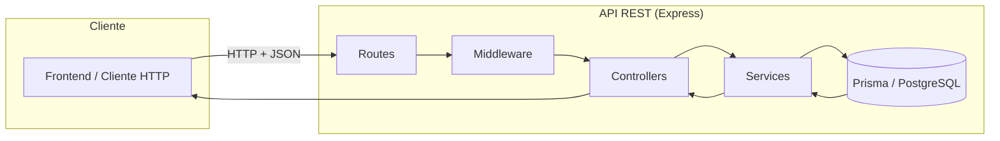
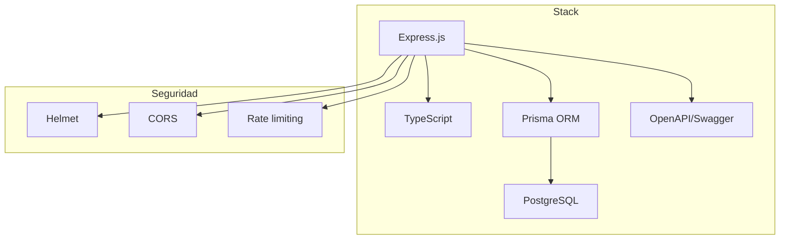

# Esquema: Mecanismos para el Desarrollo de Web Services y Autenticación Remota

**Proyecto:** Electronic Health Record (EHR)  
**Documento:** Esquema de los mecanismos para el desarrollo de Web Services propios e identificación de los mecanismos de autenticación remota de los Web Services desarrollados en el proyecto.

---

## 1. Mecanismos para el Desarrollo de Web Services Propios

En el proyecto EHR se han desarrollado Web Services propios siguiendo una API REST. A continuación se describen los mecanismos utilizados y su organización.

### 1.1 Stack y arquitectura

| Componente | Tecnología | Ubicación en el proyecto |
|------------|------------|---------------------------|
| **Servidor HTTP** | Express.js (Node.js) | `api/src/app.ts` |
| **Lenguaje** | TypeScript | Todo el backend en `api/src/` |
| **Base de datos** | PostgreSQL + Prisma ORM | `api/prisma/`, `api/src/config/database.ts` |
| **Documentación API** | OpenAPI 3.0 (Swagger) | `api/openapi.yaml`, `/api-docs` |
| **Validación de peticiones** | express-validator | `api/src/middleware/validation.ts` |
| **Seguridad** | Helmet, CORS, rate limiting | `api/src/app.ts` |

### 1.2 Estructura de la API REST

- **URL base:** `http://localhost:5000/api` (desarrollo).
- **Convenciones REST:** GET (lectura), POST (crear), PUT/PATCH (actualizar), DELETE (eliminar).
- **Formato:** JSON en request/response.
- **Prefijo:** Todas las rutas bajo `/api` (montadas en `api/src/routes/index.ts`).

### 1.3 Organización de rutas (módulos)

```
/api
├── /health          → Health check (sin autenticación)
├── /auth            → Login, registro, refresh token, logout
├── /users           → CRUD usuarios
├── /patients        → CRUD pacientes
├── /careers         → Carreras
├── /medical-records → Expedientes médicos
├── /appointments    → Citas
├── /medications     → Medicamentos
├── /nursing-procedures
├── /therapy-sessions
├── /psychometric-tests
├── /interconsultations
├── /reports
├── /audit-logs
└── /notifications
```

### 1.4 Capas de la API

1. **Rutas** (`api/src/routes/*.routes.ts`): definen método HTTP y path, aplican middleware (auth, validación).
2. **Controladores** (`api/src/controllers/*.controller.ts`): reciben request, llaman al servicio y envían response.
3. **Servicios** (`api/src/services/*.service.ts`): lógica de negocio y acceso a datos (Prisma).
4. **Middleware:** autenticación (`auth.ts`), validación (`validation.ts`), manejo de errores (`errorHandler.ts`).

### 1.5 Esquema de flujo de una petición (desarrollo de Web Services)





---

## 2. Mecanismos de Autenticación Remota de Web Services (en el proyecto)

En este apartado se identifican los mecanismos de **autenticación remota** utilizados en los Web Services del proyecto EHR: cómo el cliente se identifica ante el servidor y cómo se verifican las peticiones en cada llamada.

### 2.1 Esquema general

La API usa **autenticación remota basada en JWT (JSON Web Tokens)**. El cliente se autentica una vez; el servidor devuelve tokens; las peticiones posteriores llevan el token en el header `Authorization`.

```
┌─────────────┐                    ┌─────────────────────┐
│   Cliente   │                    │   API (Backend)     │
│  (Frontend) │                    │   Express + JWT     │
└──────┬──────┘                    └──────────┬──────────┘
       │                                      │
       │  POST /api/auth/login                │
       │  { email, password }                 │
       │─────────────────────────────────────>│
       │                                      │
       │  Valida credenciales (bcrypt)        │
       │  Genera accessToken + refreshToken   │
       │                                      │
       │  { user, accessToken, refreshToken }  │
       │<─────────────────────────────────────│
       │                                      │
       │  GET/POST ... /api/patients          │
       │  Authorization: Bearer <accessToken> │
       │─────────────────────────────────────>│
       │                                      │
       │  Middleware verifica JWT             │
       │  RBAC según rol                      │
       │  Respuesta con datos                 │
       │<─────────────────────────────────────│
```

**Diagrama de secuencia (autenticación remota):**

```mermaid
sequenceDiagram
  participant C as Cliente (Frontend)
  participant A as API (Backend)

  C->>A: POST /api/auth/login { email, password }
  A->>A: Validar credenciales (bcrypt)
  A->>A: Generar accessToken + refreshToken (JWT)
  A->>C: 200 { user, accessToken, refreshToken }

  Note over C: Cliente guarda tokens (store)

  C->>A: GET /api/... Authorization: Bearer &lt;accessToken&gt;
  A->>A: authenticateToken (verificar JWT)
  A->>A: authorizeRoles (RBAC)
  A->>C: 200 { data }

  opt Token expirado
    C->>A: POST /api/auth/refresh-token { refreshToken }
    A->>A: verifyRefreshToken
    A->>C: 200 { accessToken, refreshToken }
  end
```

### 2.2 Componentes de autenticación remota

| Mecanismo | Implementación en el proyecto |
|-----------|-------------------------------|
| **Identificación** | Email + contraseña en `POST /api/auth/login`. |
| **Verificación de contraseña** | bcrypt (hash/compare) en `api/src/utils/password.ts` y `api/src/services/auth.service.ts`. |
| **Emisión de credenciales** | JWT: access token y refresh token en `api/src/utils/jwt.ts`. |
| **Envío desde el cliente** | Header `Authorization: Bearer <accessToken>` (cliente en `ut-care/src/lib/api.ts` con interceptor axios). |
| **Verificación en el servidor** | Middleware `authenticateToken` en `api/src/middleware/auth.ts` (verifica firma y expiración del access token). |
| **Autorización** | Middleware `authorizeRoles(...roles)` en el mismo archivo (RBAC). |
| **Renovación de sesión** | `POST /api/auth/refresh-token` con `refreshToken` en body; se devuelve nuevo par de tokens. |

### 2.3 Flujo detallado de autenticación remota

1. **Login**
   - Cliente: `POST /api/auth/login` con `{ email, password }`.
   - Servidor: busca usuario por email, compara contraseña con `comparePassword`, genera tokens con `generateAccessToken` y `generateRefreshToken` (payload: `userId`, `email`, `role`).
   - Respuesta: `{ user, accessToken, refreshToken }`.

2. **Peticiones autenticadas**
   - Cliente: añade en cada petición `Authorization: Bearer <accessToken>` (en el proyecto mediante interceptor de axios que lee el token del store de autenticación).
   - Servidor: `authenticateToken` extrae el token del header, llama a `verifyAccessToken(token)` (jwt.verify con `JWT_SECRET`). Si es válido, asigna `req.user` (JwtPayload) y continúa.
   - Si la ruta tiene `authorizeRoles(...)`, se comprueba que `req.user.role` esté en la lista permitida.

3. **Refresh token**
   - Cuando el access token expira: cliente envía `POST /api/auth/refresh-token` con `{ refreshToken }`.
   - Servidor: `verifyRefreshToken` con `JWT_REFRESH_SECRET`; si es válido, genera nuevo access token (y en la implementación actual también refresh token) y los devuelve.

4. **Logout**
   - Cliente: llama a `POST /api/auth/logout` y elimina tokens en frontend (store). En el backend, el logout es principalmente cliente-side; la documentación indica posible lista negra de tokens (p. ej. Redis) en producción.

### 2.4 Configuración de JWT (variables de entorno)

- `JWT_SECRET`: firma del access token.
- `JWT_REFRESH_SECRET`: firma del refresh token.
- `JWT_EXPIRES_IN`: caducidad del access token (p. ej. `7d`).
- `JWT_REFRESH_EXPIRES_IN`: caducidad del refresh token (p. ej. `30d`).

Definido en `api/src/config/env.ts`.

### 2.5 Roles y control de acceso (RBAC)

Roles utilizados en autorización remota (documentados en OpenAPI y en rutas):

- `admin` — acceso completo.
- `psychologist` — expedientes, sesiones terapéuticas, evaluaciones.
- `nurse` — medicamentos, procedimientos, citas.
- `doctor` — expedientes médicos, diagnósticos.
- `receptionist` — citas, datos básicos de pacientes.

Las rutas protegidas aplican `router.use(authenticateToken)` y, donde procede, `authorizeRoles(...)` (por ejemplo en `patient.routes.ts`: `ROLES_CAN_MANAGE_PATIENTS`, `ROLES_CAN_DELETE_PATIENTS`).

### 2.6 Cliente (frontend) y uso del token

- **Store de autenticación:** `ut-care/src/store/auth.store.ts` (Zustand con persistencia en `localStorage` o `sessionStorage` según “recordarme”).
- **Cliente HTTP:** `ut-care/src/lib/api.ts` (axios con `baseURL` desde `VITE_API_URL`).
  - Interceptor de **request:** añade `Authorization: Bearer ${token}` si existe token en el store.
  - Interceptor de **response:** ante 401 hace logout (elimina token/sesión en el cliente).

Con esto, todas las llamadas remotas a la API que requieran autenticación envían automáticamente el token al backend.

---

## 3. Resumen: Mecanismos identificados

| Tema | Mecanismos en el proyecto |
|------|----------------------------|
| **Desarrollo de Web Services** | API REST con Express.js, TypeScript, Prisma, OpenAPI; rutas por módulos; capas rutas → controladores → servicios; validación con express-validator; seguridad con Helmet, CORS y rate limiting. |
| **Autenticación remota** | Login por email/contraseña; JWT (access + refresh); envío del token en header `Authorization: Bearer`; verificación en middleware; renovación con refresh token; RBAC por roles en rutas protegidas. |
| **Ubicación en código** | Auth: `api/src/services/auth.service.ts`, `api/src/utils/jwt.ts`, `api/src/middleware/auth.ts`, `api/src/routes/auth.routes.ts`. Cliente: `ut-care/src/lib/api.ts`, `ut-care/src/store/auth.store.ts`. |

---

*Documento generado a partir del análisis del repositorio Electronic Health Record.*
