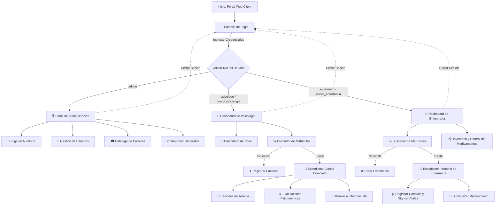

# 💻 EHR System - Frontend Web Client (ut-care)

> **Navegación Rápida:**
> *   **[🏥 Regresar al README Principal](../README.md)**
> *   **[⚙️ Backend (API REST)](../api/README.md)**
> *   **[📱 Cliente Móvil (AppEHR)](../AppEHR/README.md)**

---

## 📋 Descripción

Este módulo contiene la aplicación **web principal** del sistema EHR. Es una Single Page Application (SPA) construida con **React, TypeScript y Vite**, utilizando **TailwindCSS** para el maquetado. 

La interfaz implementa el tema visual **Crystal Glass (Glassmorphism)**, el cual incluye efectos de vidrio translúcido, difuminado de fondo (backdrop-blur), bordes sutiles y soporte para modo claro/oscuro (automático según el horario del campus o configuraciones del sistema operativo).

---

## 🗺️ Diagrama de Flujo de Pantallas

El siguiente diagrama modela la lógica de navegación del portal web en base al rol del usuario autenticado:



---

## 📋 Requisitos

*   **Node.js** v18 o superior.
*   **API backend** activa (por defecto configurada en `http://localhost:5000/api`).

---

## 🚀 Instalación y Desarrollo Local

1.  **Navegar al directorio del frontend:**
    ```bash
    cd ut-care
    ```
2.  **Instalar dependencias:**
    ```bash
    npm install
    ```
3.  **Configurar variables de entorno:**
    Crea un archivo `.env` copiando la plantilla base:
    ```bash
    cp .env.example .env
    ```
    *Asegúrate de que la variable `VITE_API_URL` apunte a tu servidor de API local (`http://localhost:5000/api`).*

4.  **Iniciar servidor de desarrollo:**
    ```bash
    npm run dev
    ```
    *El frontend estará disponible en http://localhost:5173.*

---

## 🗂️ Estructura del Proyecto (Atomic Design)

```
ut-care/
├── src/
│   ├── components/
│   │   ├── atoms/          # Botones, entradas y tarjetas base (GlassCard)
│   │   ├── molecules/      # Selectores de idioma, selectores de tema, inputs validados
│   │   └── organisms/      # Barra de navegación, calendarios, formularios complejos
│   ├── layouts/            # Plantilla general (MainLayout)
│   ├── pages/              # Páginas completas (LoginPage, DashboardPage, ExpedientePage)
│   ├── store/              # Manejo del estado global con Zustand (auth.store, theme.store)
│   ├── i18n/               # Diccionarios de traducción (locales/es, locales/en)
│   ├── lib/                # Configuración de clientes HTTP (Axios) y servicios API
│   ├── App.tsx             # Enrutador y raíz de componentes React
│   ├── main.tsx            # Entry point de la aplicación
│   └── index.css           # Estilos globales y utilidades de Glassmorphism
```

---

## 🧪 Pruebas End-to-End (Playwright)

Las pruebas automatizadas de aceptación y flujos completos de navegación del cliente web residen en la carpeta principal `/e2e` en la raíz del repositorio. 

Estas pruebas validan:
*   El inicio de sesión exitoso y restricciones por rol.
*   Navegación al Dashboard según permisos.
*   Flujo completo de registro de pacientes e historial clínico.

Para ejecutar los tests locales, lee el instructivo detallado en **[e2e/README.md](../e2e/README.md)**.
Los formularios web cuentan con atributos estables `data-testid` (como `login-username`, `login-password` y `login-submit`) para evitar roturas ante futuros rediseños visuales.
